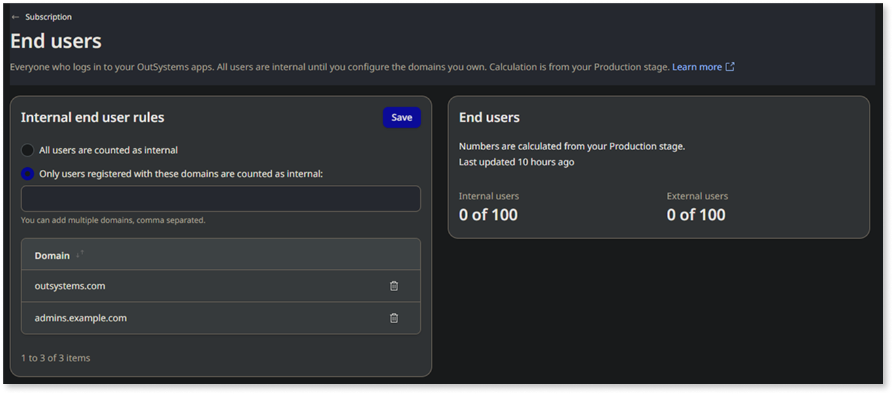

# Classify end-users in ODC

By default, in ODC, all end-users are considered internal until you configure specific domains that you own in the ODC Portal.

Any users with an email address matching those domains are classified as internal, and any other email domains are classified as external. This is important because [internal and external end-user capacities are licensed separately](https://www.outsystems.com/tk/redirect?g=907b0fd3-bc46-4391-aae2-673296d795d9).

ODC classifies users without an email address as internal users. You can implement flows that promote users to [update an email](../reference/system-actions/user.md#startupdateemail) address in their User Profile.

| Criteria         | Internal End-User                                             | External End-User                                              |
|----------------------|-------------------------------------------------------------------|---------------------------------------------------------------------|
| **Email domain**     | Matches a domain you configured in the ODC Portal                | Doesn't match any configured domain                                |
| **No email address** | Counted as internal                                              | Not applicable                                                      |
| **License usage**    | Counts toward internal end-user quota                            | Counts toward external end-user quota                              |
| **Typical users**    | Employees, internal collaborators                                | Customers, partners, third parties                                        |
| **How to configure** | Add your organization's email domains in the **Manage Subscription** section of the ODC Portal | Automatically applies to all other domains                          |

## Configure your domains for user classification

1. In the ODC Portal, click your tenant name, and select **Manage Subscription**.

    

1. From the **Overview** tab, click **External end users** or **Internal end users**.

1. In the **Internal end-users rules** section, select **Only users registered with these domains count as internal** and enter the domain names that you own.

1. Click **Save** to add your domains.

    

After saving your changes, the system starts the process of calculating the current internal and external end-users, which might take a few minutes. ODC recalculates your number of internal and external users every 24 hours.

## Related resources

* [Add custom domains for your apps](../manage-platform-app-lifecycle/custom-domains.md)
