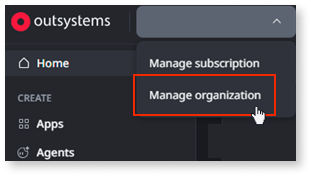
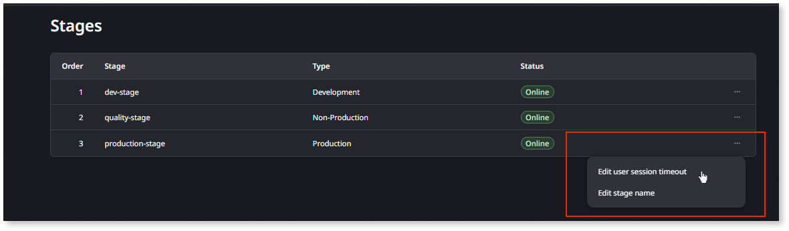
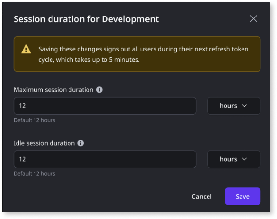

# Configure user session

OutSystems Developer Cloud (ODC) lets you configure how long user sessions last and how long they remain active when idle. You configure these settings per stage in the ODC Portal. Since all apps in a stage share a single sign-on (SSO) context, the session settings apply to all apps in that stage.

User session configuration applies to apps accessed by end users only. For members (IT-users) accessing the ODC Portal and ODC Studio, the session timeout is 12 hours and can't be modified.

## What is a user session?

A user session is the authenticated period between when a user logs in and when they must re-authenticate. The following settings control when a session ends:

* **Maximum session duration** — The absolute time limit. Once this period elapses from login, the session ends regardless of activity.

* **Idle session duration** — How long the session stays valid without user interaction. Each interaction resets the idle session duration.

The session ends when either limit is reached. By default, both are set to 12 hours.

### Example

With a **maximum session duration** of 8 hours and an **idle session duration** of 20 minutes:

* A user is active for 9 hours. The session ends after 8 hours when the maximum session duration expires.

* A user is active for 1 hour, then inactive for 25 minutes. The session ends after 20 minutes of inactivity when the idle session duration expires.

## Session settings

The following table describes the available session settings:

| Setting | Description | Range | Default |
| --- | --- | --- | --- |
| **Maximum session duration** | The total time a session stays valid before the user must re-authenticate, regardless of activity. Set as a whole number in minutes, hours, or days. | 1 hour to 45 days | 12 hours |
| **Idle session duration** | The maximum time a session remains valid without user activity. The idle session duration resets with each user interaction. The idle session duration must be less than or equal to the maximum session duration. Set as a whole number in minutes, hours, or days. | 5 minutes to 45 days | 12 hours |

## Configure user session settings

Before you can configure user session settings, ensure you have the [**Manage authentication**](roles.md#permissions-registry) permission.

To configure session settings for a stage, follow these steps:

1. Go to the ODC Portal and select **Manage organization**.

    

1. On the **Stages** screen, click the ellipsis next to the stage you want to configure and select **Edit user session timeout**.

    

1. Set the **Maximum session duration** and **Idle session duration** values.

    The idle session duration must be less than or equal to the maximum session duration.

    When you change session settings, all signed-in users are logged out within approximately 5 minutes (during their next refresh token cycle) and must log in again.

    

1. Click **Save**.

## How session configuration works

### Per-stage configuration

Each stage (for example, development, QA, production) has its own session settings. This lets you apply shorter timeouts in production for security reasons while allowing longer sessions in development for convenience.

### Refresh token rotation

ODC uses access tokens to authorize requests. When an access token expires, the platform automatically uses a refresh token to issue a new one. ODC enforces refresh token rotation, meaning each refresh issues a new token and immediately invalidates the old one. If a previously used token is reused, ODC revokes all related tokens and terminates the session, requiring the user to re-authenticate.

### Multiple sessions

You can have multiple active sessions across different devices. There's no limit on the number of concurrent sessions.

## Related resources

For more information about platform limits in ODC, refer to [Platform limits and constraints](../getting-started/system-requirements.md).
