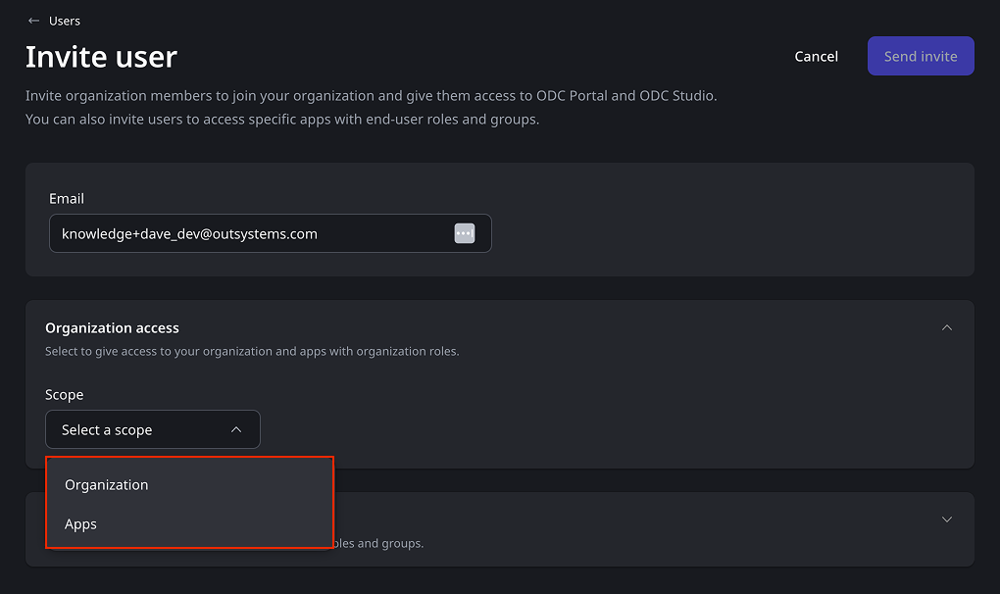
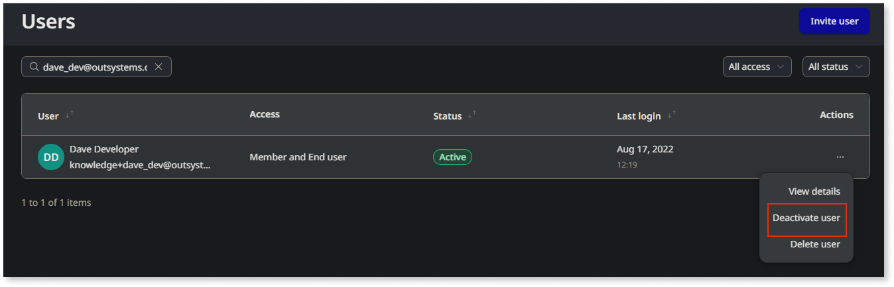
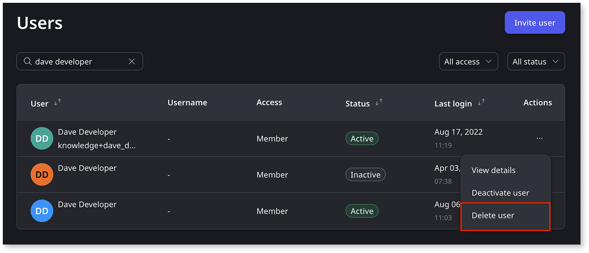

# Create, activate, deactivate, and delete users

This article explains how to create, activate, deactivate, and delete users in OutSystems Developer Cloud (ODC), covering both members (IT-users) and end-users. These actions help you manage access to your organization’s resources and applications efficiently and securely.

<div class="info" markdown="1">

To manage users programmatically, refer to [User and access management API](../reference/apis/identity-v1.md) and [ODC REST APIs](../reference/apis/public-rest-apis/overview.md).

</div>

## Required permissions

To view the permissions required for managing users, refer to [Roles and permissions for members (IT-Users)](roles.md).

## Creating users

You can add users to your ODC organization (tenant) as either [members (IT-users)](#create-new-members) or [end-users](#create-new-end-users).

<div class="info" markdown="1">

When users log in using an external IdP, ODC automatically registers them after their first successful login.

For more information about claim mapping and profile matching, refer to [Claim mapping and profile matching](../manage-platform-app-lifecycle/external-idps/identity-claims-email-verification.md#claim-mapping-logic).

For more information about granting roles, refer to [Grant and revoke user roles](grant-and-revoke-user-roles.md).

</div>

### Create new members (IT-users) {#create-new-members}

To manually register [members (IT-users)](intro.md#members-it-users), follow these steps:

1. Go to the **ODC Portal**.

1. Under **Manage**, go to **Users**.

1. Click **Invite user**.

1. Enter the user’s email address, and then expand **Organization access**.

1. Assign roles to the user. Choose a [scope](intro.md#organization-app-stage-and-app-scope):

    * **Organization**: Choose a role for the tenant.

    * **Apps**: For each app, choose a role or leave it as **Unassigned** if you don't want to assign a role to the user for that app.

      

    <div class="info" markdown="1">

    For more details about how permissions are applied at the **organization** or **apps** scope, refer to [effective permissions](roles.md#effective-permissions-calculation) calculation.

    </div>

1. Click **Send invite**.

    The invited user receives an email with a verification code and a link to join your tenant in the ODC Portal.

    <div class="info" markdown="1">

    To edit the roles you assigned during the creation process, refer to [Grant and revoke user roles](grant-and-revoke-user-roles.md).

    </div>

### Create new end-users {#create-new-end-users}

<div class="info" markdown="1">

 You can enable self-registration in your app to allow end-users to sign up on their own. For more information, see the [Self-registration flow](../building-apps/ui/self-registration/intro.md).

</div>

To manually register [end-users](intro.md#end-users), follow these steps:

1. Go to the **ODC Portal**.
1. Under **Manage**, go to **Users**.
1. Click **Invite user**.
1. Enter the user’s email address, and then expand **End-user access**.
1. Select the [end-user groups](./end-users/groups.md) you want to assign to the user.
1. From the list of roles available for each app, select all applicable roles.  

    For more information on how to create end-user roles, refer to [Secure your app with end-user roles](secure-app-with-roles.md#create-end-user-roles).

1. Click **Send invite**.

    The invited user receives an email with a verification code and a link to join your tenant in the ODC Portal.

    <div class="info" markdown="1">

    To edit the roles you assigned during the creation process, refer to [Grant and revoke user roles](grant-and-revoke-user-roles.md).

    </div>

### Invitations, reinvitations, and user statuses {#invitations-reinvitations-and-user-statuses}

ODC assigns each user a status that indicates whether they completed registration and whether they can log in. The status affects login behavior and what happens when you invite a user by using an email address that already exists in your organization.

#### User statuses

The following are the user statuses:

* **Active**: The user completed registration and can log in.
* **Invited**: The user received an invitation email but hasn't completed the registration.  
    An invited user completes the registration by following the link in the invitation email and entering the verification code in the ODC Portal.
* **Pending registration**: The user started the self-registration but hasn’t completed it.  
    A user completes the self-registration by opening the verification email, following the link, entering the verification code, and setting a password.
* **Inactive**: An administrator deactivated the user. ODC blocks this user from logging in until an administrator activates the user again.

In the [User and access management API](../reference/apis/identity-v1.md), `isActive` controls the user’s initial status. Set `isActive` to `true` in order to create the user as **Active**, or to `false` for **Inactive**.

#### Common status transitions

Here are some typical ways the user status can change:

* **Invited** to **Active**: The user completes the registration.
* **Pending registration** to **Active**: The user completes the self-registration.
* **Active** to **Inactive**: An administrator deactivates the user.
* **Inactive** to **Active**: An administrator activates the user.

<div class="info" markdown="1">

If a user was **Invited**, didn't complete the registration, and then signs in through an [external identity provider (IdP)](../manage-platform-app-lifecycle/external-idps/intro.md), ODC changes the user status to **Active**. The user can still complete the registration later to set up a password for built-in authentication.

For more information, refer to [Built-in authentication in combination with external IdPs](../manage-platform-app-lifecycle/external-idps/identity-claims-email-verification.md#built-in-authentication-password-sign-in).

</div>

#### Common scenarios for user status and external IdP access

The following table summarizes common scenarios for user status and external IdP access:

| Scenario | Status | Can access via external IdP |
| :---- | :---- | :---- |
| User invited, hasn't completed registration | **Invited** | Yes, status remains **Invited** |
| User invited, logs in via external IdP, then completes registration | **Invited** → **Active** | Yes throughout |
| User invited, never completes registration, only uses external IdP | **Invited** (permanently or [workaround](#enable-built-in-authentication) is used) | Yes, but no built-in IdP access |
| User self-registers, hasn't completed registration | **Pending registration** | Yes, status remains **Pending registration** |
| User created via external IdP only | **Active** | Yes, but no built-in IdP access |
| User inactivated by admin | **Inactive** | No |

#### Invite an existing user of the built-in IdP in the ODC Portal

If you invite a user by using an email address that already belongs to an existing user, the ODC Portal behavior depends on the user’s status:  

* **Active**: The ODC Portal blocks the invitation and shows an error. Update roles for the existing user instead of creating a new user.
* **Invited**: Use **Resend invitation** to send a new invite email.

#### Invite an existing user of the built-in IdP using the user and access management API

Use the [user and access management API](../reference/apis/identity-v1.md) to add the user to the built-in IdP when the user was created for an external IdP. For more information, refer to [Enable built-in authentication for an external IdP user](#enable-built-in-authentication).

### Enable built-in authentication for an external IdP user {#enable-built-in-authentication}

Use this procedure when a user was created only after logging in with an external IdP and needs to log in with built-in authentication too. For example, this applies if the external IdP isn’t assigned to the organization.

To enable built-in authentication for an existing user, follow these steps:

1. Create a built-in identity provider profile for the user by calling `POST /users` in the [User and access management API](../reference/apis/identity-v1.md) and setting `addToBuiltInIdentityProvider` to `true`.

    Use the exact email address of the existing user profile.

    Example request body:

    ```
    {
        "email": "user@example.com",
        "isActive": true,
        "addToBuiltInIdentityProvider": true,
        "name": "Ignored",
        "photoUrl": null
    }
    ```

    <div class="info" markdown="1">

    Keep these considerations in mind:

    * The email address must match the existing user profile exactly.
    * Include `name` and `photoUrl` in the request body. These fields are required, but ODC doesn’t overwrite existing user profile data.
    * This action doesn’t send an email to the user.

    </div>

1. Ask the user to reset their password.

    For more information, refer to [Passwords](passwords.md).

## Deactivate and activate users

You can deactivate users to temporarily prevent them from accessing the ODC Portal, Studio, or any apps, while retaining their data and assignments for auditing or future reactivation. You can reactivate users at any time to restore their access.

To deactivate or activate a user, follow these steps:

1. Go to the **ODC Portal**.
1. Under **Manage**, go to **Users**.
1. For each user you want to update, under **Actions**, click the three dots (**...**).
1. Click **Deactivate user** or **Activate user** as appropriate, and then confirm the action.

    

    The user's status updates to **Inactive** or **Active** based on your action.

## Delete users

Deleting a user permanently removes their access and all related data from the system. This action can't be undone.

1. Go to the **ODC Portal**.
1. Under **Manage**, go to **Users**.
1. For each user you want to delete, under **Actions**, click the three dots (**...**).
1. Click **Delete**, and then confirm the action.

    

<div class="warning" markdown="1">

Deleting a user can't be undone. If you may need to restore access in the future, consider deactivating the user instead.

</div>

## Related resources

* [Best practices for user governance](best-practices-user-management.md)
* [Managing members (IT-users)](it-users/intro.md)
* [Managing end-users](end-users/intro.md)
* [Password management in ODC](passwords.md)
* [Grant and revoke roles](grant-and-revoke-user-roles.md)
* [Create custom roles for members (IT-users)](roles.md)
* [Create end-user roles](secure-app-with-roles.md)
* [User management](intro.md)
