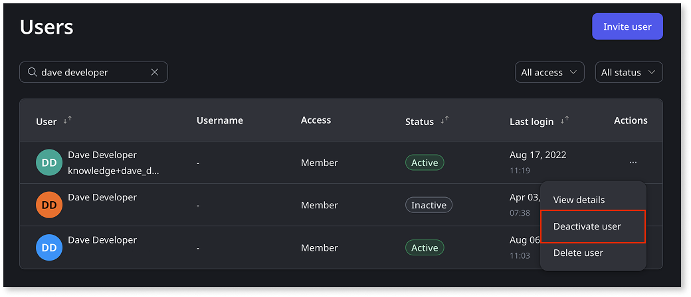

# Create, activate, deactivate, and delete users

This article explains how to create, activate, deactivate, and delete users in OutSystems Developer Cloud (ODC), covering both members (IT-users) and end-users. These actions help you manage access to your organization’s resources and applications efficiently and securely.

To manage users programmatically, refer to [User and access management API](../reference/apis/identity-v1.md) and [ODC REST APIs](../reference/apis/public-rest-apis/overview.md).

## Required permissions

To view the permissions required for managing users, refer to [Roles and permissions for members (IT-Users)](roles.md).

## Creating users

You can add users to your ODC organization (tenant) as either [members (IT-users)](#create-new-members) or [end-users](#create-new-end-users).

When users log in using an external IdP, ODC automatically registers them after their first successful login.

For more details about mapping claims when configuring an IdP, refer to [Understand the user creation and claim mapping logic](../manage-platform-app-lifecycle/external-idps/intro.md#claim-mapping-logic).

For more information about granting roles, refer to [Grant and revoke user roles](grant-and-revoke-user-roles.md).

### Create new members (IT-users) {#create-new-members}

To manually register [members (IT-users)](intro.md#members-it-users), follow these steps:

1. Go to the **ODC Portal**.

1. Under **Manage**, go to **Users**.

1. Click **Invite user**.

1. Enter the user’s email address, and then expand **Organization access**.

1. Assign roles to the user. Choose a [scope](intro.md#organization-app-stage-and-app-scope):

    * **Organization**: Choose a role for the tenant.

    * **Apps**: For each app, choose a role or leave it as **Unassigned** if you don't want to assign a role to the user for that app.

      

    

    For more details about how permissions are applied at the **organization** or **apps** scope, refer to [effective permissions](roles.md#effective-permissions-calculation) calculation.

    

1. Click **Send invite**.

    The invited user receives an email with a verification code and a link to join your tenant in the ODC Portal.

    

    To edit the roles you assigned during the creation process, refer to [Grant and revoke user roles](grant-and-revoke-user-roles.md).

    

### Create new end-users {#create-new-end-users}

 You can enable self-registration in your app to allow end-users to sign up on their own. For more information, see the [Self-registration flow](../building-apps/ui/self-registration/intro.md).

To manually register [end-users](intro.md#end-users), follow these steps:

1. Go to the **ODC Portal**.
1. Under **Manage**, go to **Users**.
1. Click **Invite user**.
1. Enter the user’s email address, and then expand **End-user access**.
1. Select the [end-user groups](./end-users/groups.md) you want to assign to the user.
1. From the list of roles available for each app, select all applicable roles.  

    For more information on how to create end-user roles, refer to [Secure your app with end-user roles](secure-app-with-roles.md#create-end-user-roles).

1. Click **Send invite**.

    The invited user receives an email with a verification code and a link to join your tenant in the ODC Portal.

    

    To edit the roles you assigned during the creation process, refer to [Grant and revoke user roles](grant-and-revoke-user-roles.md).

    

## Deactivate and activate users

You can deactivate users to temporarily prevent them from accessing the ODC Portal, Studio, or any apps, while retaining their data and assignments for auditing or future reactivation. You can reactivate users at any time to restore their access.

To deactivate or activate a user, follow these steps:

1. Go to the **ODC Portal**.
1. Under **Manage**, go to **Users**.
1. For each user you want to update, under **Actions**, click the three dots (**...**).
1. Click **Deactivate user** or **Activate user** as appropriate, and then confirm the action.

    

    The user's status updates to **Inactive** or **Active** based on your action.

## Delete users

Deleting a user permanently removes their access and all related data from the system. This action can't be undone.

1. Go to the **ODC Portal**.
1. Under **Manage**, go to **Users**.
1. For each user you want to delete, under **Actions**, click the three dots (**...**).
1. Click **Delete**, and then confirm the action.

    

Deleting a user can't be undone. If you may need to restore access in the future, consider deactivating the user instead.

When users are deleted at the external IdP, ODC logs them out at the next refresh when using OIDC with refresh tokens (the `offline_access` scope). Refer to [Refresh token-driven user revalidation (OIDC only)](../manage-platform-app-lifecycle/external-idps/intro.md#refresh-token-sync-oidc).

## Related resources

* [Best practices for user governance](best-practices-user-management.md)
* [Managing members (IT-users)](it-users/intro.md)
* [Managing end-users](end-users/intro.md)
* [Password management in ODC](passwords.md)
* [Grant and revoke roles](grant-and-revoke-user-roles.md)
* [Create custom roles for members (IT-users)](roles.md)
* [Create end-user roles](secure-app-with-roles.md)
* [User management](intro.md)
