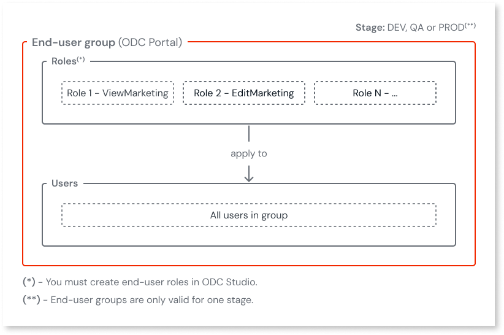

# Manage end-user groups

End-user groups in OutSystems Developer Cloud (ODC) help you efficiently manage app access by grouping users with the same roles and permissions. By assigning roles to groups instead of individual users, you can simplify user onboarding, streamline access management, and ensure consistent security policies across your organization.

To create an end-user group, you must:

* **Assign [end-user roles](../secure-app-with-roles.md#create-end-user-roles)** to the end-user group. All users assigned or mapped to the end-user group will inherit these roles and permissions.
* **Add users, group mappings, or both**. You can add users directly to the end-user group, map external IdP groups to end-user groups in ODC, or both. All users added or mapped to the end-user group automatically inherit the roles assigned to that group.

For more details on how to create end-user groups, refer to [Create end-user groups](#create-end-user-group).

## Benefits of end-user groups

Here are some key benefits and practical applications of using end-user groups in ODC:

* **Simplified user onboarding and bulk management:** Add users to an end-user group to automatically grant them the roles and permissions associated with that group. This approach is ideal for onboarding new employees or managing temporary access for projects.

    For example, when onboarding a new marketing team, you can create a Marketing end-user group in ODC, assign the necessary roles (such as access to the marketing dashboard and marketing project details screens in your app), and then add all new marketing employees to this end-user group. Each user immediately receives the correct permissions. With end-user groups, you only assign the roles once instead of manually assigning the roles to each employee.

    

* **Standardized access control:** Assign permissions at the end-user group level to ensure users within a team or department have uniform access. This reduces errors, ensures compliance, and simplifies updates when permissions need to change.

* **Flexible permissions through multiple end-user group membership:** Users belonging to several end-user groups gain the combined access rights of those groups, supporting cross-team responsibilities.

    For example, if a user is in both the Marketing and Finance end-user groups, they automatically receive access to the Marketing dashboard and Finance reporting screens without any additional configuration.

* **Integration with IdPs:** Map identity provider (IdP) groups to end-user groups to automate user provisioning and role assignment.

    For example, if your organization uses Azure AD as an IdP, you can map the Marketing Team group in Azure AD to an end-user group in ODC. When a new team member logs in via Azure AD, they're automatically added to the corresponding end-user group and granted the roles you previously assigned to the end-user group in the ODC Portal.

    For more details on how to map IdP groups to end-user groups, refer to [IdP and end-user group mapping](../../manage-platform-app-lifecycle/external-idps/end-user-group-mapping.md).

  

  Group mapping handles role assignment. User creation and identification still rely on the IdP claims you mapped when you configured an IdP.
  
  For more details about mapping claims when configuring an IdP, refer to [Understand the user creation and claim mapping logic](../../manage-platform-app-lifecycle/external-idps/intro.md#claim-mapping-logic).
  
  

## Prerequisites

Before you configure end-user groups, make sure you meet the following conditions:

* **End-user roles must be created**: For more details on how to create end-user roles, refer to [Secure your app with end-user roles](../secure-app-with-roles.md#create-end-user-roles).
* **External IdPs must be configured and assigned** (only needed if you want to map IdP groups to end-user groups): For more details on how to configure and assign an IdP, refer to [Configure authentication with external identity providers](../../manage-platform-app-lifecycle/external-idps/intro.md).
* **Required permissions:** To create end-user groups in ODC, you need the appropriate permissions. For details, refer to [Roles and permissions for members (IT-Users)](../roles.md).

## Creating and managing end-user groups

You can manage end-user groups through the ODC Portal.

### Create an end-user group { #create-end-user-group }

To create a new end-user group in ODC, follow these steps:

1. In the ODC Portal, go to  **Manage** > **End-user groups**.
1. Click **Create group**, and then select the [stage](intro.md#organization-app-stage-and-app-scope) (for example, **Development**, **QA**, or **Production**).

    

    Each end-user group is limited to one stage. Once you choose a stage, you can't change it. To use a different stage, you must create a new group.

    

1. Enter a **Group name** and (optionally) a description.

1. You can assign end-user roles, add group mappings, and assign users either now or after you create the end-user group:
   * To assign end-user roles for specific apps, click **Add roles**.
   * To integrate with an external IdP, click **[Add group mapping](../../manage-platform-app-lifecycle/external-idps/end-user-group-mapping.md#mapping-end-user-groups-option)**.
   * To assign users to the end-user group, click **Add users**.
1. Click **Create Group**.

### Edit roles for an end-user group

To change the roles of an end-user group, follow these steps:

1. In the ODC Portal, go to **Manage** > **End-user groups**.
1. In the **End-user groups** list, click the end-user group you want to edit.
1. On the **End-user roles** tab, click **Manage roles**.
1. Select or clear the roles you want to grant or revoke to the end-user group for each app.
1. Click **Save**.

All users in the end-user group automatically inherit the updated roles. This only applies to the app stage you selected when you created the group.

### Add or remove users from an end-user group { #remove-users-group }

To add or remove users from an end-user group in ODC, follow these steps:

1. In the ODC Portal, go to **Manage**, > **End-user groups**.
1. In the **End-user groups** list, click the end-user group you want to edit.
1. On the **Users** tab, click **Assign users**.
1. Select or clear the users you want to add or remove from the end-user group.
1. Click **Save**.

The end-user group is updated.

### Delete an end-user group

Deleting an end-user group removes all role assignments the user inherited from the group. Users can lose access to apps if they don't have those roles assigned to them through other end-user groups or direct assignment.

To delete an end-user group in ODC, follow these steps:

1. In the ODC Portal, go to **Manage** > **End-user groups**.
1. In the ODC Portal, under **Manage**, go to **End-user groups**.
1. In the **End-user groups** list, click the end-user group you want to edit.
1. Remove all users from the end-user group.  

    For more details, refer to [Add or remove users from a group](#remove-users-group).
1. Next to **Edit group details**, click the **ellipsis** (3-dots), and then click **Delete group**.
1. Confirm the deletion.

The end-user group is deleted.

### Update the group name and description

To update the end-user group name and description in ODC, follow these steps:

1. In the ODC Portal, go to **Manage** > **End-user groups**.
1. In the **End-user groups** list, click the end-user group you want to edit.
1. Click **Edit group details**.
1. Enter the new **group name** and **group description**.
1. Click **Save**.

The end-user group name and description are updated.

## Related resources

* [Best practices for user management](../best-practices-user-management.md)
* [Managing authorization and authentication for end-users](intro.md)
* [IdP and end-user group mapping](../../manage-platform-app-lifecycle/external-idps/end-user-group-mapping.md)
* [Grant and revoke user roles](../grant-and-revoke-user-roles.md#grant-roles-to-end-users)
* [Secure your app with end-user roles](../secure-app-with-roles.md)
* [User management REST APIs](../../reference/apis/identity-v1.md)
