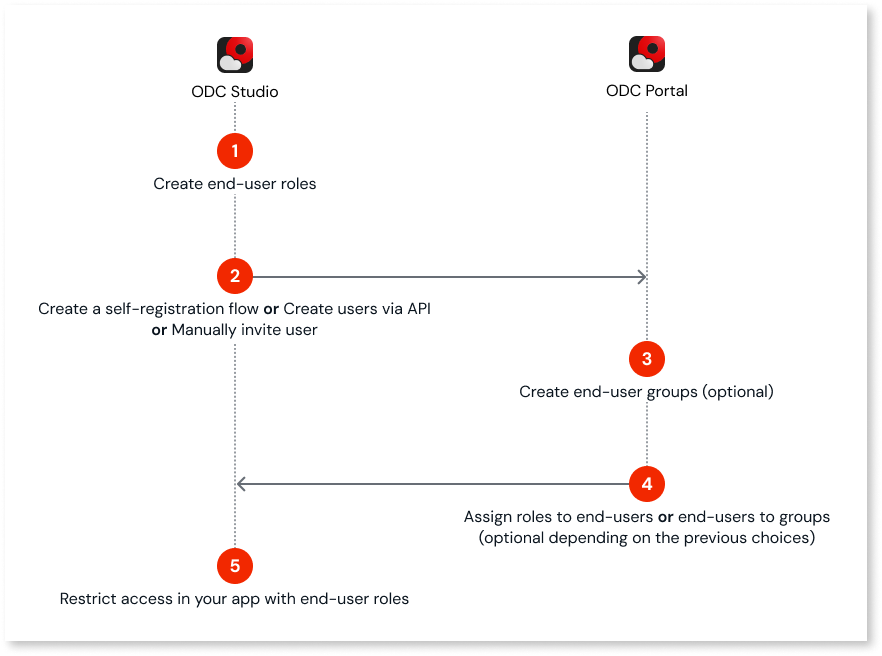
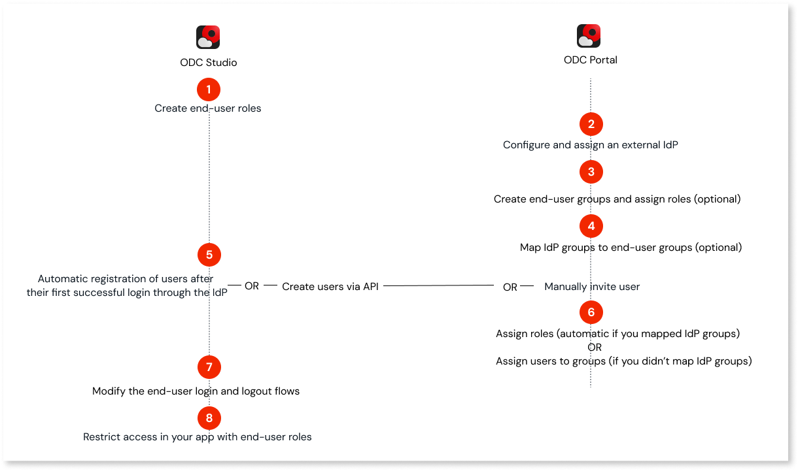

# Managing authorization and authentication for end-users

This topic provides a high-level overview of how to manage [authentication and authorization](../intro.md#authentication-and-authorization-in-odc) for [end-users](../intro.md#end-users) in OutSystems Developer Cloud (ODC). Use this page as a starting point to understand the main steps, and where to find detailed procedures.

You can use either ODC's built-in authentication or integrate with an external Identity Provider (IdP).

## Managing end-users with built-in authentication

End-users with built-in authentication are managed in the ODC Portal and ODC Studio.

To manage end-users using built-in authentication, follow these steps:

1. [Create end-user roles](../secure-app-with-roles.md#create-end-user-roles) in ODC Studio to define the different types of access and permissions.

1. Add members. Choose one of the following options:

    * Create a [self-registration](../../building-apps/ui/self-registration/intro.md) in ODC Studio to let users register when they access the app if they don't already have an account. This is the recommended option unless you need to create users in bulk using [APIs](../../reference/apis/identity-v1.md).

    

    Self-registration is available only for built-in authentication.

    

    * Manually [create users](../create-deactivate-and-delete-users.md#create-new-end-users).

    * Programmatically: [Create users via API](../../reference/apis/identity-v1.md).

1. (Optional) [Create end-user groups](groups.md) with the end-user roles you want to assign for each app.

1. (Optional) [Assign roles](../grant-and-revoke-user-roles.md#grant-roles-to-end-users) or [groups](groups.md) to end-users if you haven't already done so during the manual creation of users.

1. [Restrict access in your app with end-user roles](../secure-app-with-roles.md#control-access-in-your-app-with-end-user-roles) to control which users can access specific screens, data, and app features based on their roles.

## Managing end-users with external Identity Provider (IdP) authentication

You can integrate ODC with external Identity Providers (IdPs) for authentication (for example, Azure AD, Google), and manage end-users in the ODC Portal and ODC Studio.

To manage end-users using external IdP authentication, follow these steps:

1. [Create end-user roles](../secure-app-with-roles.md#create-end-user-roles) in ODC Studio to define the different types of access and permissions.

1. [Configure and assign an external IdP](../../manage-platform-app-lifecycle/external-idps/intro.md): Set up an IdP and assign it to the stage you want in the ODC Portal.

1. (Optional) [Create end-user groups](groups.md) with the end-user roles you want to assign for each app.

1. (Optional) Add [group mappings](../../manage-platform-app-lifecycle/external-idps/end-user-group-mapping.md) to connect IdP groups to end-user groups.

    

    ODC automatically assigns mapped users to the end-user group when they log in using the external IdP.

    After a user logs in and ODC maps them to one or more groups, any changes to their group membership in the IdP appear in ODC only the next time the user logs in. Until then, the user continues to appear as a member of their previously mapped groups.

    

1. User registration. Choose one of the following options:

    * Automatically: Wait for the end-users to be created after their first successful login through the IdP.

    

    End-users who haven't been manually added or added via API can still sign in through the IdP.

    When users log in using an external IdP, ODC automatically registers them after their first successful login.

    For more information about mapping claims when configuring an IdP, refer to [Understand the user creation and claim mapping logic](../../manage-platform-app-lifecycle/external-idps/intro.md#claim-mapping-logic).

    

    * Manually [create users](../create-deactivate-and-delete-users.md#create-new-end-users) using their IdP email address.

    * Programmatically: [Create users via API](../../reference/apis/identity-v1.md).

1. [Assign roles](../grant-and-revoke-user-roles.md#grant-roles-to-end-users) or [groups](groups.md) to end-users if you haven't already done so during the manual creation of users. This step isn't necessary if you mapped IdP groups to end-user groups: ODC automatically adds users to the appropriate groups and assigns them the roles configured for the group.

1. Modify the [end-user login and logout flows](../../manage-platform-app-lifecycle/external-idps/apps.md) for each app you plan to integrate with the external IdP.

1. [Restrict access in your app with end-user roles](../secure-app-with-roles.md#control-access-in-your-app-with-end-user-roles) to control which users can access specific screens, data, and app features based on their roles.

## Related resources

* [Best practices for user management](../best-practices-user-management.md)
* [Secure your app with end-user roles](../secure-app-with-roles.md)
* [Create or delete users](../intro.md#manage-users)
* [Self-registration process](../../building-apps/ui/self-registration/intro.md)
* [Grant and revoke roles](../secure-app-with-roles.md#manage-roles-in-app-runtime)
* [Manage groups](groups.md)
* [Assign end-user roles in ODC Portal](../intro.md#end-user-roles)
* [User management REST APIs](../../reference/apis/identity-v1.md)
* [Role-based Security online course](https://learn.outsystems.com/training/journeys/.role-based-security-575)
