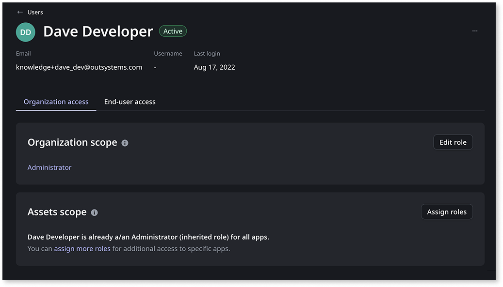
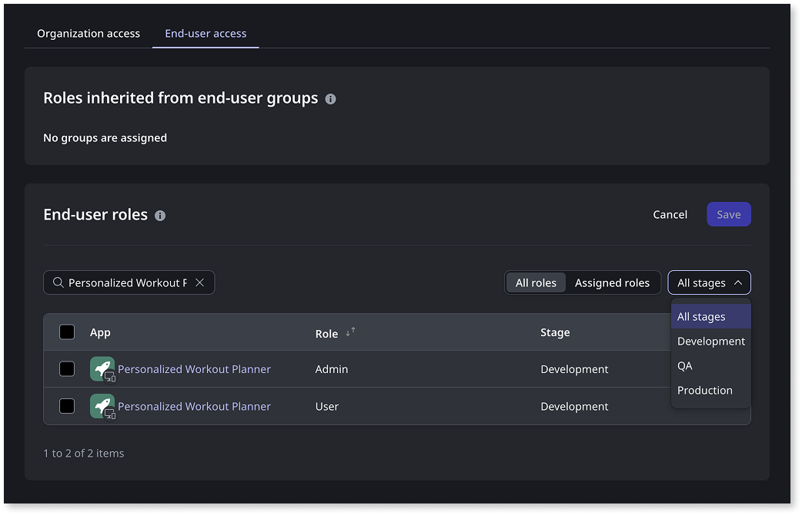

# Grant and revoke user roles

This article explains how to grant and revoke user roles in OutSystems Developer Cloud (ODC). Assigning and revoking roles helps you manage the [authorization](intro.md#authorization) for both members (IT-users) and end-users, ensuring they have the appropriate level of access to your organization's resources and applications.

To manage roles programmatically, refer to [User and access management API](../reference/apis/identity-v1.md) and [ODC REST APIs](../reference/apis/public-rest-apis/overview.md).

## Prerequisites

Before you can grant or revoke user roles, make sure you meet the following conditions:

* **Users must be registered:** Users must already be created in your ODC organization (tenant) before you can grant or revoke roles. For instructions on creating users and assigning roles during creation, refer to [Create, activate, deactivate, and delete users](create-deactivate-and-delete-users.md).
* **Required permissions:** To manage roles, you need the appropriate permissions. For details, refer to [Roles and permissions for members (IT-Users)](roles.md).
* **Roles must be created**:

    * For more details on how to create custom roles for members (IT-users), refer to [Roles and permissions for IT Users](roles.md).

    * For more details on how to create end-user roles, refer to [Secure your app with end-user roles](secure-app-with-roles.md).

## Grant or revoke user roles

You can manage user roles for both members [(IT-users)](#grant-roles-to-members) and [end-users](#grant-roles-to-end-users) in the ODC Portal. The process varies depending on the type of user and the scope of access you want to manage.

### Grant or revoke roles for members (IT-users) {#grant-roles-to-members}

Members (IT-users) can have roles at different scopes within your organization. You can assign organization-level roles for tenant-wide access or app-specific roles for granular permissions.

To grant or revoke a role for a member (IT-user):

1. Go to the **ODC Portal**.
1. In the **Manage** section, go to **Users**.
1. Search for the member you want to update, and then click anywhere in the user's row.

1. To grant or revoke a role at the [**Organization scope**](intro.md#organization-app-stage-and-app-scope):
    1. On the **Organization access** tab, click **Edit role**.
    
    1. Change the role:
        * To grant a role, pick one option from the dropdown list.
        * To revoke a role, pick **No role** from the dropdown list.

    

    You can't have more than one role for the organization scope. Consider adding a [custom role](roles.md#custom-roles) with the permissions you want instead.

    

1. To grant or revoke roles at the [**Assets scope**](intro.md#organization-app-stage-and-app-scope):
    1. On the **Organization access** tab, click **Assign roles**.
    1. Change the roles:
        * To grant a role, pick the role you want for each app from the dropdown list.  
        * To revoke a role, pick **Unassigned** for the relevant app from the dropdown list.

1. Click **Save**.

The user immediately receives or loses the permissions associated with the chosen roles.

If you remove all roles from a user, the user may lose access to the ODC Portal, Studio, or specific apps, depending on your configuration.

### Grant or revoke roles for end-users {#grant-roles-to-end-users}

End-users can have roles that control their access to specific applications and stages. These roles determine what features and data end-users can access within your applications.

To grant or revoke a role for an end-user:

1. Go to the **ODC Portal**.

1. In the **Manage** section, go to **Users**.

1. Search for the end-user you want to update, and then click anywhere in the user's row.

1. Go to the **End-user access** tab, and then click **Assign roles**.

1. Select or clear the checkbox for the roles corresponding to each app and stage (**Development**, **QA**, or **Production**) to which you want to assign or revoke a role for the user.
  
    

    For more information on how to create end-user roles, refer to [Secure your app with end-user roles](secure-app-with-roles.md#create-end-user-roles).

1. Click **Save**.

The end-user immediately receives or loses the roles you assign or remove. If your applications already use these roles to control access or behavior, the changes take effect right away, and the end-user's access or experience will update accordingly.

If you remove all roles from an end-user, the user may lose access to the associated apps.

## Related resources

* [Best practices for user governance](best-practices-user-management.md)
* [Managing members (IT-users)](it-users/intro.md)
* [Managing end-users](end-users/intro.md)
* [Password management in ODC](passwords.md)
* [User management](intro.md)
