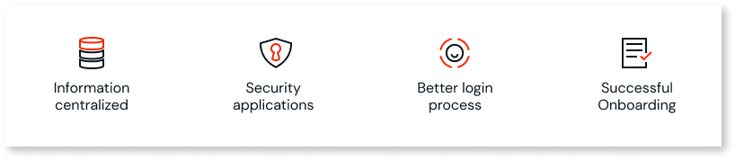

# User management

User management in OutSystems Developer Cloud (ODC) is about setting up and providing access to a person who uses ODC. People are assigned **roles** such as administrator, developer, architect, or end-user (also known as an app user). A key part of user management is ensuring that users have the correct access to organization resources and apps in accordance with your access rules.

In this document, the term organization refers to the ODC account your company manages. All users are part of an organization. To use ODC, all users are assigned roles with different permissions.

Users with organization roles can access the ODC Portal and use ODC Studio to build, manage, and deploy apps. Users with end-user roles only have access to your apps.

You can create groups of end-users. All end-users in the group have access to the same roles and apps. For example, you might create a group of end-users from the marketing team who need different access than a group of end-users from the finance team.

ODC enables you to use groups to accelerate giving users roles and access to apps. You can only add end-users to groups. Your ODC admin creates the group and adds end-users to the group. You associate groups and apps to roles.

The ODC Portal is the  place to manage users, and you can:

* Invite a new user
* Assign, revoke, or changes roles for all users
* View and manage all users that have organization and end-user roles
* Create a group
* Add or remove users from the group
* Add or remove roles associated with a group
* View all existing groups and users in a group
* View all roles and apps associated with the group
  

## Permissions

Permissions enable users to perform tasks in the ODC Portal, ODC Studio, or an app. Roles and permissions for the role, define what users can do in ODC. You can create only one user for each email address. An individual can have different roles and types of access.

When you assign a role to a person, that person is automatically granted the permissions selected for that role. You can associate permissions to one or more stages (Development, QA, or Production) and apps. This helps to limit, for example, what a user can do in production.

ODC has **organization** roles and **end-user** roles to limit access.

* Organization roles are for users that need access to both the ODC Portal and ODC Studio. You can assign built-in or custom roles at the organization or app levels.
* End-user roles are for those users accessing the apps you create in ODC.

You define permissions based on tasks you want to allow a user to perform. You then grant permissions to the roles and assign users to the roles. You can apply permissions to a specific app.

It's important that when you define permissions, you define them at the lowest level. Only give users access to what they must be able to do to complete a particular task. For example, you might want a user to be able to view all apps but only be able to make changes to a single app.

A single permission can belong to multiple roles. Some **permissions inherit other permissions** automatically. For example, if you grant a role in the Development stage, such as the **Change Application** permission, that role automatically gets the **Debug and Deploy Application** permission. So, the person now has three permissions.

## Organization roles

An organization role groups a set of permissions that you can assign to users in your organization. You can apply these permissions to a stage, but you don't need to apply all permissions to a stage.

To see the organization roles:

1. From  **ODC Portal** select **Users & access** > **Organization roles**.
1. Select a role to see the table of permissions.
1. Hover the mouse pointer over the permission in the table to display more information.

An organization role groups permissions in the following sections:

* App management
* Configurations
* Deployment management
* Forge
* Monitoring
* Stage
* User management

### Built-in organization roles

ODC comes with two built-in organization roles: **Administrators** and **Developers**. Both roles can invite new users, but Developers can only grant access to applications (end-user roles) and only for the Development stage.

You can view these roles and assign them to users, but you can't **delete or modify** them. You can **duplicate** these roles. When you duplicate a built-in role, you make a copy of that role. ODC adds the word **copy** to the end of the current name (Developer-copy). You can't use the same name as the existing built-in role. You should give your new role a descriptive name, such as **Developer-cloud**. Once you duplicate (copy) the role, you can make any modifications you want to the role.

### Custom organization roles

A custom organization role is any role that you create. You can create a new role, or you can duplicate an existing role and then make changes. At a minimum, you must give the role a new name and at least one permission. As soon as you add a role name and one permission, the **Create** button is available.

From the **Create role** screen, within each section, such as **Deployment Management** > **Deploy apps** select the stage (Development, QA, or Production) for which you want to enable the permission. You can always come back to this screen to adjust the permissions.

## End-user roles

End-user roles are specific to apps. You create end-user roles in ODC Studio while you develop an app. After you publish the app, you use the ODC Portal to assign the end-user role to users. Go to **Users & access** > **Users**. Search for the user, and in the user page below End-user roles, select **Manage roles**.

For more information about app dev development and end-user roles, see: [Secure your app with end-user roles](../building-apps/secure-app-with-roles.md).

## End-user groups

To accelerate the onboarding of users, ODC enables you to create groups of users. Using groups enables you to grant users roles in bulk. Before you can add users to groups, users must be part of your ODC organization.

Manage the groups from the ODC **Portal** > **Users & access** > **End-user groups**. When adding a  new group, enter a group name. You need to enter a group name. All other fields are optional.

You can add roles to a group before or after you add users to a group. Users in the group get all end-user roles associated with that group. Users can belong to multiple groups. You can create a new group in a different stage, with the same name or a different name, and use the same or similar roles.

You must select a stage to which the group belongs. Once you select a stage for the group and save it, you can't change the stage. The group members can only access the end-user roles and apps in the selected stage.

A person with **Manage end-user groups** permission can add users to a group, select users from a list of existing users and add them to the group. Once you save the group, it's available immediately. Adding or removing roles also takes effect immediately.

## Add new users or end-user groups to your organization

You can add new users to your organization and apps through the ODC Portal.

From the **ODC Portal**, select **Users & access** and then select either **Users** or **End-user groups**.

Clicking  **Users**, displays a screen that shows a list of users. To invite a new user, from the top right,click the **Invite user** button. A form displays to enter the user's email and select their access. Based on your choices, different options become available.

* If you choose **Member access**, you can select an organization and an app.
* If you choose **End user access**, you can add the user to a group, assign roles related to a specific app or all apps, and a specific stage or all stages. You can choose more than one app at a time. A group can only have roles from the same stage. For example, if your group is in the Development stage you can't add roles from the Production stage.

When a user signs into an app, their user profile information is synchronized to the [User entity](../reference/system-actions/user.md#user-1) of that app.

 Clicking  **End-user groups**, displays a screen that shows the groups available. To create a new group, from the top right, click the **Create group** button. A dropdown arrow lets you choose the stage in which you want to create the group. Then enter a group name and a description. At the same time you can select one or more apps.

## Activate, deactivate, or delete users

Manage the users in the **ODC Portal** > **Users**.

To **activate** a user, you must first invite the user. Once a user accepts the invitation, you see them as active in the list of users.

To **deactivate** a user, from the actions menu, select **Deactivate**. A confirmation message displays, click **Yes, deactivate user.** The user now displays as deactivated.

To **delete** a user, from the actions menu, select **Delete user**. A confirmation message displays, click **Yes, delete user.** The user is deleted and their name is deleted from the list of users.

## Give or revoke a user role

You can assign or revoke a user's role. This applies to  individual roles and group roles.  

From the **ODC Portal**, select **Users & access**> **Users**. A table displays all existing users. You can:

* Sort the list by users, status, and last login date
* Manage the user's role by selecting the user
* Add a new user by clicking **Invite user**

When you assign or revoke a role to an authenticated user, it can take up to a minute for the change to become active.

## Passwords for users

New users must set up their own passwords. The password must be at least 12 characters long and contain at least:

* One lowercase letter
* One numeric digit
* One character from this set: `!`, `\`, `#`, `$`, `%`, `&`, `'`, `(`, `)`, `*`, `+`, `,`, `-`, `.`, `/`, `:`, `;`, `<`, `=`, `>`, `?`, `@`, `[`
* One upper-case letter

### Manage user passwords

Only users can manage their password. Users can change their password using the **ODC Portal** > **User dropdown** > **Change password**. After five failed password change attempts, ODC temporarily locks a user out. To reset the lockout, users must refrain from signing in for 15 minutes.

Users with an organization role can also recover their forgotten password from the Portal login page by clicking **Forgot password**.

Admins don't have permission to change or recover other users' passwords.

Use pre-built user screens in your app to enable end-users to change and recover their password. See [Custom authentication flows](../building-apps/ui/custom-auth.md) for more information. If the user of an app has an organization role, currently they must recover their password using the Portal.
