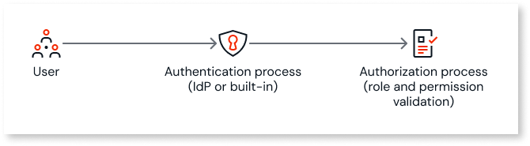

# User management

User management in OutSystems Developer Cloud (ODC) ensures secure and efficient access to your organization’s resources and apps. It involves managing **users**, **roles**, **permissions**, and **groups** to control access and define what users can do within the platform.

This article introduces key concepts and points to detailed guides for managing users in ODC.

## Types of users in ODC

This diagram illustrates the distinct categories of users within ODC and their typical interactions.

ODC supports three main types of users: Members (IT-users), End-users, and API clients.

### Members (IT-users) { #members-it-users }

Members, such as administrators, developers, and architects, access the ODC Portal and ODC Studio to build, manage, and deploy apps. They can also have custom roles with specific permissions and don't count for licensing. These users aren't included in your licensed end-user count, so adding members doesn't affect your licensing limits.

For more information, refer to [Managing members](it-users/intro.md).

### End-users { #end-users }

End-users interact with your web or mobile apps but don't access the ODC Portal or ODC Studio. They're typically external users or internal users with limited access.

You can group end-users to simplify management. Internal and external end-user capacities are [licensed separately](https://www.outsystems.com/tk/redirect?g=907b0fd3-bc46-4391-aae2-673296d795d9). For details on classifying internal and external users, refer to [Classify Users in ODC](classify-users.md). For more information on how to manage end-users, refer to [Managing end-users](end-users/intro.md).

A single user in ODC can act as both a member and an end-user, depending on their assigned roles.

### API clients

API clients are non-human users that interact with ODC programmatically.

For more information, refer to [ODC REST APIs](../reference/apis/public-rest-apis/overview.md), [About the API client](../reference/apis/public-rest-apis/authentication/about-api-client.md), and [Getting started with APIs](../reference/apis/public-rest-apis/getting-started.md).

## Authentication and authorization in ODC { #authentication-and-authorization-in-odc }

Authentication and authorization in ODC ensure secure access to resources by verifying user identities and defining what actions they can perform within the platform.

### Authentication { authentication }

Authentication verifies a user’s identity before granting access. ODC supports the following mechanisms:

* **Built-in authentication**: ODC’s native authentication system.  

    Built-in authentication provides a simple and secure way to manage user access without relying on external identity providers.

    With built-in authentication:

    * Members can securely access the ODC Portal and ODC Studio, for managing apps and resources.

    * End-users can securely access the apps you create in ODC Studio.

    * Users can register themselves to access your app without human intervention using a self-registration flow. This flow supports email-based verification codes to validate users. For more information, refer to [Self-registration flow](../building-apps/ui/self-registration/intro.md).

    * You can manually register users, providing greater control over who can access your apps and resources.

    * You can enforce password policies, such as complexity, to enhance security.

    * ODC manages user sessions with a default timeout of 12 hours to ensure secure access.

* **External Identity Providers (IdPs)**: Use third-party IdPs for authentication.  

    For more information, refer to:

    * [Assign and configure an IdP](../manage-platform-app-lifecycle/external-idps/intro.md).

    * [Use external identity providers in an app](../manage-platform-app-lifecycle/external-idps/apps.md).

### Authorization { #authorization }

Authorization determines what a user can do after authentication. It's managed through:

* **Roles**: Define a user’s responsibilities and access level. For example:

    * A **Developer** role includes permissions to create apps.

    * A **Viewer** role might only allow viewing app data.

    For more details on roles for IT-users, refer to [Roles and permissions for IT Users](roles.md).

    For more details on roles for end-users, refer to [Secure your app with end-user roles](secure-app-with-roles.md).

* **Permissions**: Granular controls assigned to roles to limit access to specific tasks or resources. You can apply permissions at different levels. For more information, refer to the [Organization, app stage, and app scope](#organization-app-stage-and-app-scope) section.

* **Groups (available only for end-users)**: Collections of end-users with shared roles and permissions. Groups simplify managing access to apps.

    For example, you can create a group for the marketing team and assign it specific roles and app access.

    For more information, refer to [Manage end-user groups](end-users/groups.md).

## Organization, app stage, and app scope { #organization-app-stage-and-app-scope }

ODC organizes access into three scopes:

* **Organization scope**: Access to the ODC Portal and ODC Studio for managing the platform and all applications across the organization.

* **App stage scope**: Access to all apps within a specific stage. For example: development, QA, and production.

* **App scope**: Access to a specific application.

These scopes define the level at which you can assign [roles](#authorization) and permissions to users, as well as configure [end-user groups](end-users/groups.md) and [Identity Providers (IdPs)](../../../build/eap/manage-platform-app-lifecycle/external-idps/intro.html). While roles are assigned at the organization or app level, app stage scope is mainly relevant when assigning permissions while creating [custom roles](roles.md) and when managing IdPs. Understanding these scopes helps you control what resources users can access and what actions they can perform, ensuring secure and efficient management.

## Related resources

* [Best practices for user management](best-practices-user-management.md)
* [Managing authorization and authentication for end-users](end-users/intro.md)
* [Managing authorization and authentication for members (IT-users)](it-users/intro.md)
* [Create, activate, deactivate, and delete users](create-deactivate-and-delete-users.md)
* [Grant and revoke user roles](grant-and-revoke-user-roles.md)
* [Basic User Management in ODC](https://learn.outsystems.com/training/journeys/user-management-odc-881) online course
* [Role-Based Security](https://learn.outsystems.com/training/journeys/role-based-security-575) online course
* [Basic Governance for End-Users](https://learn.outsystems.com/training/journeys/basic-governance-for-end-users-2693) online course
* [OWASP Web Security](https://learn.outsystems.com/training/journeys/introduction-to-web-security-3324) online course
