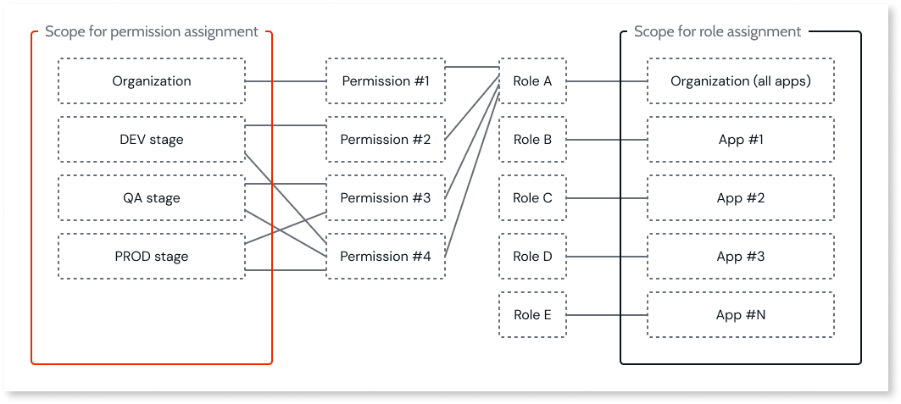

# Roles and permissions for members (IT-users)

This article covers permissions for [members (IT-users)](intro.md#members-it-users) who build and manage apps in ODC. For information about end-user roles, refer to [Secure your app with end-user roles](secure-app-with-roles.md).

In ODC, you control what your members (IT-users) can do by assigning them roles. A role is a set of permissions that you can grant at the **organization** and **asset** (**app**) [**scopes**](intro.md#organization-app-stage-and-app-scope).

ODC allows implementing user access control policies on the following domains:

* Asset (apps and libraries) management
* Stage visibility
* Release management
* Application monitoring
* AI Mentor System
* Configuration and connection management
* User management
* Forge access
* Support cases management
* Subscription management

## Effective permissions calculation

Permissions are applied at the **organization** or **app stage** [scope](intro.md#organization-app-stage-and-app-scope). A user's total permissions are the sum of all roles assigned to them at both the **organization** and **asset** (**app**) [**scopes**](intro.md#organization-app-stage-and-app-scope). You can assign one role for the organization scope, and one role for each app.

The fundamental rule is that permissions are cumulative. A role assigned at the app scope adds to the permissions granted at the organization scope.

An app-level role can grant additional permissions for that specific app, but it can never revoke permissions a user already has from an organization-level role.

### Permission scenarios

Here’s how this principle works in practice.

**Scenario 1: A more permissive role is assigned at the app level**
:   A user has a general role for the organization but needs elevated permissions for one app:

    * Organization Role: Developer.
    * App Role: Administrator.
    * Result: The user has Developer permissions across the organization. For the specific app where they are an Administrator, they gain the additional permissions of that role. For example, they can now manage that app's configurations in Production stage, a permission the Developer role doesn't have.

**Scenario 2: A less permissive role is assigned at the app level**
:   A user has a high-level role for the organization, and a more restrictive role is assigned for one app:

    * Organization Role: **Administrator**.
    * App Role: **Developer**.
    * Result: The organization-level permissions prevail. Since app-level roles can't remove permissions, the user remains an Administrator for the entire organization, including the specific app. The Developer role at the app level has no effect.

## Types of roles for members (IT-users) { #types-of-roles }

ODC provides two types of roles for members (IT-users), built-in roles, and custom roles.

For details on how to assign or remove roles for members, refer to [Grant and revoke user roles](grant-and-revoke-user-roles.md#grant-roles-to-members).

### Built-in roles

ODC includes two built-in organization roles:

| Role           | Description                                                                                  |
|----------------|---------------------------------------------------------------------------------------------|
| Administrator  | Full access to all platform features, including user management, deployment, and configuration. |
| Developer      | Access to build and manage apps. Can invite new users and grant end-user roles, but only for the **Development** stage.|

You can't delete or modify built-in roles, but you can duplicate them to create custom roles.

To see the full list of permissions for the **Admin** or **Developer** role, in the ODC Portal, go to **Organization roles**, and then click **Admin** or **Developer**. Both roles are identified with the **Built-in role** label.

### Custom roles { #custom-roles }

You can create custom roles to tailor permissions to your organization's needs. Custom roles let you select specific [permissions](#permissions-registry) and apply them at **organization** or **app stage** [scope](intro.md#organization-app-stage-and-app-scope). After creating a custom role, you need to assign it to users either at **organization scope** or to specific **apps**. For more details on how to create custom roles and how to assign a role to a user, refer to [Create custom roles for members](#create-custom-roles-for-it-users) and [Grant or revoke roles to members](grant-and-revoke-user-roles.md#grant-roles-to-members).

For more details about recommended custom roles, refer to [Recommended custom roles for members (IT-users)](#recommended-custom-roles).

## Create custom roles for members (IT-users) { #create-custom-roles-for-it-users }

To create a custom role for members, follow these steps:

1. In the ODC Portal, under **Manage**, go to **Organization roles**.
1. Click **Create role**.
1. Enter a name for the role.
1. Select the permissions you want to assign. You may limit some [permissions](#permissions-registry) to specific stages if needed.  
1. Click **Create** to save the role.

## ODC permissions { #permissions-registry }

The following table lists the permissions you can assign to custom roles. For more details on **organization** (global) and **asset** (**app**) scope, refer to [Organization, app stage, and app scope](intro.md#organization-app-stage-and-app-scope).

Some permissions are automatically inherited by others to ensure consistent behavior and prevent errors. When configuring custom roles in the ODC Portal, selecting a permission may automatically select additional related permissions due to these dependencies.

| Category                  | Permission Name                     | Purpose                                                                                                                                                                                                                           | Scope                           |
|---------------------------|-------------------------------------|-------------------------------------------------------------------------------------------------------------------------------------------------------------------|--------------------------------|
| Asset management          | Open                               | Users can open assets.                                                                                                                                                                                        | Organization   Asset           |
| Asset management          | Create                             | Users can create new assets.                                                                                                                                                                                  | Organization                         |
| Asset management          | Debug                              | Users can view, open and debug assets.                                                                                                                                                                       | Organization   Asset           |
| Asset management          | Change                             | Users can view, open, debug and publish assets.                                                                                                                                                             | Organization   Asset           |
| Asset management          | Delete                             | Users can delete assets.                                                                                                                                                                                    | Organization   Asset           |
| Stage                     | View stage                         | Users can view a given stage.                                                                                                                                                                               | Organization                         |
| Release management        | Deploy apps                        | Users can initiate asset deployments to a specified stage and undeploy from the production stage.                                                                                                           | Organization   Asset           |
| Release management        | Release                            | Users can release an asset, assign a version number (1.0.0), and add release notes.                                                                                                                         | Organization   Asset           |
| Monitoring                | Access asset logs and traces       | Users can view asset logs and traces in a given stage.                                                                                                                                                      | Organization   Asset           |
| Monitoring                | Access user information            | Users can view user information connected to a given log or activity.                                                                                                                                       | Organization   Asset           |
| Monitoring                | App security                       | The user with this permission has access to the Vulnerability Overview report screen.                                                                                                                       | Organization   Asset           |
| Monitoring                | Audit Trail View                   | This permission enables users to view the audit logs.                                                                                                                                                       | Organization                         |
| AI Mentor System          | Edit/Change Code Quality findings  | Provides access to a Code Quality Console and interactive capabilities, including the ability to modify the status of findings and manage comments. Additionally, if permissions are set at the organizational level, users will see which organizational users have introduced those findings, change status, and add comments. | Organization   Asset                 |
| AI Mentor System          | View Code Quality findings         | Provides users access to a Code Quality Console to monitor code standards and allow visibility of application findings for those with appropriate permissions. Additionally, If the permissions are set at the organizational level it will allow users to see which organizational users have introduced those findings.                                                                                                | Organization   Asset                 |
| Configuration management  | View configurations                | Users can view app or library configurations in a given stage.                                                                                                                                              | Organization   Asset           |
| Configuration management  | Edit configurations                | Users can change app or library configurations in a given stage.                                                                                                                                            | Organization   Asset           |
| Configuration management  | Configure connections              | Users can view and edit connection configurations in a given stage.                                                                                                                                         | Organization                         |
| Configuration management  | Manage custom domains              | Users can view, create, edit, and delete custom domains for apps.                                                                                                                                           | Organization                         |
| Configuration management  | Manage Email SMTP configuration    | Users can view, create, edit, and delete SMTP emails.                                                                                                                                                       | Organization                         |
| Configuration management  | Manage API clients                 | Users can manage API Clients, create, suspend, delete, change permissions, and rotate secrets.                                                                                                                           | Organization                         |
| Configuration management  | Manage CSP                         | The user can view, create, edit, and delete CSP (Content Security Policy) rules at each stage.                                                                                                              | Organization                         |
| Configuration management  | Manage log streaming               | Users can view, create, edit, and delete streams.                                                                                                                                                           | Organization                         |
| Connection management     | Create                             | Users can create connections.                                                                                                                                                                               | Organization                         |
| Connection management     | Change                             | Users can view connections and edit entities, name, and description.                                                                                                                                        | Organization                         |
| Connection management     | Delete                             | Users can delete connections.                                                                                                                                                                               | Organization                         |
| User management           | View end users                     | Users can view users with end-user roles.                                                                                                                                                                   | Organization   Asset           |
| User management           | View organization members          | Users can view users with organization roles.                                                                                                                                                               | Organization                         |
| User management           | Manage users                       | Users can view, activate, deactivate, and delete other organization members and end users.                                                                                                                  | Organization                         |
| User management           | Manage end-user access             | Users can grant or revoke end-user roles.                                                                                                                                                                   | Organization   Asset           |
| User management           | Manage end-user groups             | Users can view, create, edit, and delete end-user groups.                                                                                                                                                   | Organization                         |
| User management           | Manage organization access         | Users can view organization members and grant or revoke organization roles.                                                                                                                                 | Organization                         |
| User management           | Manage organization roles          | Users can create, edit, and delete organization roles.                                                                                                                                                      | Organization                         |
| User management           | Manage authentication              | The user with this permission can view and manage the authentication providers to access the organization and apps.                                                                                         | Organization                         |
| Forge                     | Install/Update assets              | Users can install or update assets from Forge.                                                                                                                                                              | Organization                         |
| Forge                     | Submit/Edit assets                 | Users can submit assets to Forge and edit them.                                                                                                                                                             | Organization                         |
| Support                   | Open support cases                 | Users can open and view their support cases.                                                                                                                                                                | Organization                         |
| Support                   | View all support cases             | Users can view all the organization's support cases.                                                                                                                                                        | Organization                         |
| Subscriptions             | View subscription                  | Users can view the organization's subscription information.                                                                                                                                                 | Organization                         |

## Recommended custom roles for members (IT-users) { #recommended-custom-roles }

As a general guideline, you can create the following custom roles based on the scope to use when assigning roles to a member:

* **App scope**: Basic Developer, Tech Lead.
* **Organization scope**: Basic Member, Architect, Tenant Admin.

In this reference model, the **Architect** role is responsible for the ownership and lifecycle of the asset portfolio, including creating, deleting, and installing assets from Forge, as well as managing releases. The **Tenant Admin** role focuses on global infrastructure configurations, not on asset or release management. If a user needs both sets of permissions, assign the built-in **Admin** role, which combines all capabilities.  

This approach supports a DevOps-oriented model, where delivery teams (**Tech Lead** + **Developers**) have full ownership of their assigned assets (and only theirs).

The following table outlines the permissions you can configure for each of these recommended custom roles:

| Category                        | Basic Developer                                   | Tech Lead                                              | Basic                   | Architect                                         | Tenant Admin                                         |
|----------------------------------------|---------------------------------------------------|--------------------------------------------------------|-------------------------|---------------------------------------------------|-----------------------------------------------------|
| Asset management                       | Change assets                                     | Change assets                                          | Not allowed             | Create and delete assets                           | Not allowed                                           |
| Stage visibility                       | View all stages                                   | View all stages                                        | View Development Stage   | View all stages                                    | View all stages                                       |
| Release management                     | Release Assets Deploy to Development           | Release Assets Deploy to all stages                | Not allowed             | Release Assets Deploy to all stages            | Not allowed                                           |
| Monitoring                 | Monitor all stages                                | Monitor all stages View security vulnerabilities   | Not allowed             | Monitor all stages View security vulnerabilities | Monitor all stages View security vulnerabilities  |
| AI Mentor System                       | View  Code Quality findings                   | Edit  Code Quality finding                         | Not allowed             | Edit  Code Quality finding                     | Edit  Code Quality finding |
| Configuration  Connection management | Apply app configurations  in Development      | Apply app configurations  in all stages Configure external entities | Not allowed             | View app configurations  in all stages Configure external entities | Apply infra configurations in all stages Create and delete connections  Manage API Clients |
| User management                        | View end-users                                    | Manage  end-user access and groups                 | Not allowed             | View organization users                            | Manage users and organization roles Manage authentication providers |
| Forge access                           | Not allowed                                       | Submit assets                                          | Not allowed             | Install and submit assets                          | Not allowed                                           |
| Support                | Open support cases                                | Open support cases                                     | Not allowed             | Open and view  all support cases               | Open and view  all support cases                  |
| Subscriptions                | Not allowed                                       | Not allowed                                            | Not allowed             | Not allowed                                        | Allowed                                               |

## Related resources

* [Managing authorization and authentication for members (IT-users)](it-users/intro.md)
* [Create, activate, deactivate, and delete users](create-deactivate-and-delete-users.md)
* [Grant or revoke roles to members](grant-and-revoke-user-roles.md#grant-roles-to-members)
* [Best practices for user governance](best-practices-user-management.md)
* [Role-based security](https://learn.outsystems.com/training/journeys/role-based-security-575) online course
* [Managing authorization and authentication for end-users](end-users/intro.md)
* [User management](intro.md)
