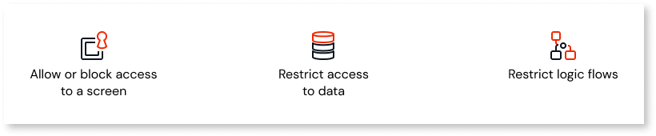

# Secure your app with end-user roles

When you create a role, and assign it to a user, you can control access to screens, data and functionalities of your app. You can manage user roles from ODC (OutSystems Developer Cloud) Studio and from ODC Portal. In ODC Studio, you design logic to control access.

When setting up roles for end-users, consider the following: 

* What do the end-users need to accomplish?
* What screens do they need to be able to access?
* What tasks do you want them to be able to do?
* What information can end-users see and what needs to remain inaccessible?
 
## How to use roles

This is an overview of how to use roles:

1. In ODC Studio, create end-user roles.
1. In ODC Portal, assign end-user roles to users.
1. In ODC Studio, use end-user roles to control access to the parts of the app. You can also grant and revoke a role to any user programmatically.

### Create end-user roles

To create roles in ODC Studio during design, follow these steps: 

1. Go to the **Logic** tab > **Roles** > right-click the **Roles** folder > select **Add Role**. 

1. Enter **Name**, **Description**.

1. Select **Yes** from **Public** drop-down to set the role as Public. The default value is No.

When ODC Studio creates a role, it also creates a set of related actions you can use to [manage roles](#manage-roles-in-app-runtime) during runtime.

### Assign roles to users through ODC Portal

After you publish an app that has end-user roles, the end-user roles are available in ODC Portal. See [how to assign end-user roles in ODC Portal](../user-management/intro.md#end-user-roles).

### Manage roles in app runtime

After you create a role, ODC Studio also creates the following actions to let you manage the roles during the app runtime, in the app logic. These actions let you programmatically check, grant, or revoke a role.

| Action             | Example           | Description                                             |
| :------------------ | :----------------- | :------------------------------------------------------- |
| CheckROLENAMERole* | CheckManagerRole  | Returns True if the current user has the ROLENAME role. |
| GrantROLENAMERole  | GrantManagerRole  | Grants ROLENAME to the user with the UserId.            |
| RevokeROLENAMERole | RevokeManagerRole | Revokes ROLENAME from the user with the UserId.          |

**Notes**

(*) Available for both client and server logic. The light icon denotes the client-side version.

## Control access in your app with end-user roles

After you assign roles to your end-users, you can:

* Allow or block access to a screen
* Restrict access to data
* Restrict logic flows

Logged-in users needs to log out and log back in for changes in their assigned roles or role permissions to become effective.

### Restrict access to a screen

To allow only users with a certain role to access a screen, you need to [create some roles first](#create-end-user-roles). You can then allow only registered users to access screens in the app.

1. Select the screen for which you want to edit the access.

1. From the screen properties, select **Authorization** > **Accessible by** and from the list select **Authenticated users**. The list of roles from all apps under the Organization where the roles are set as public shows in the **Authorization** section.

1. Select at least one user role from the list to give access to the screen.

### Restrict logic flows

In ODC Studio, in the logic of actions, use **CheckROLENAMERole()** function in the If element. You can do that by adding the If element to the logic flow, and then editing the **Condition** field.

For example, if you enter `CheckManagerRole()` in the **Condition** field of the If element, the logic of the true branch runs only if the current user has a Manager role.

### Restrict access to data

Use **CheckROLENAMERole()** function in expressions to verify that the user of the app has a role.

For example, you can create a filter in an aggregate with the expression `CheckAdminsRole() = True`. This aggregate now returns data only if the signed-in user has an Admin role.
