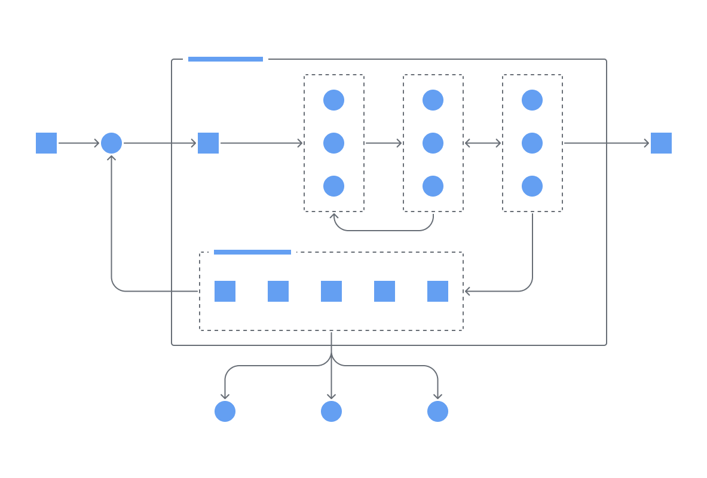
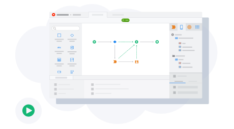
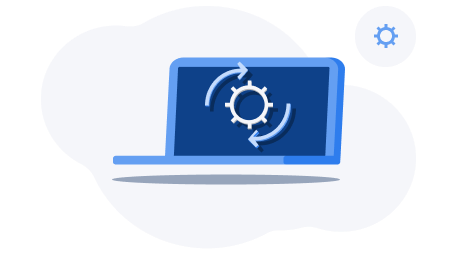

# Welcome to OutSystems Developer Cloud (ODC) docs

Learn about ODC and how to use it. ODC documentation is under construction. It's frequently updated and expanded.

## O11 to ODC

Start here to see ODC information that highlights differences with OutSystems 11.

## Cloud native architecture

The state-of-the-art container architecture that supports an always-on development platform and apps built to scale.

## Building apps

Learn about development concepts such as data, UI, and reusing elements.

## Configuration management

Learn how ODC Portal lets you adjust the configuration values for stages like development, testing, or production.

