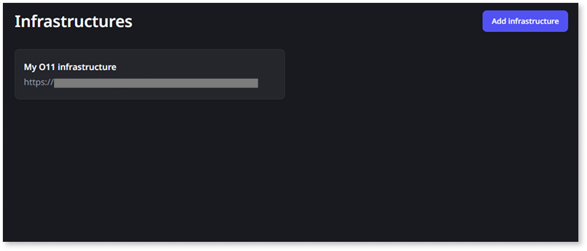
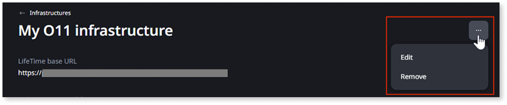

# Connect ODC to your O11 infrastructure

The following capabilities between O11 and ODC require the connection of your ODC organization to the O11 infrastructure:

* [Consume O11 entities in your ODC apps](data-interoperability/data-interop.md)

* [Consume O11 logic in your ODC apps](logic-interoperability/logic-interop-reuse-o11-odc.md#reuse-o11-logic-odc) over a secure private connection

You manage the connection between ODC and O11 in the ODC Portal, under the **Management** menu, **OUTSYSTEMS 11 > Infrastructures**.

This page describes how to [add an infrastructure](#add-infrastructure) to connect your ODC organization to an O11 infrastructure. If you have more than one O11 infrastructure that you want to extend with ODC capabilities, add a separate infrastructure for each one.

## Prerequisites

To create and manage the connection from ODC to an O11 infrastructure, make sure the following requirements are met:

* The O11 infrastructure meets the required **LifeTime** version. Refer to [interoperability version requirements](version-requirements.md#connectivity) for further details.

* You must have the **Administrator** role in ODC Portal.

## Add an O11 infrastructure to ODC {#add-infrastructure}

To prevent cross-organization access, ODC accepts only LifeTime service accounts that you bind to your ODC organization ID in LifeTime, and validates that binding when you save the configuration.

For this configuration you have to switch between the ODC Portal and LifeTime to complete the setup.

Follow these steps to add an O11 infrastructure to ODC:

1. Log into the ODC Portal.

1. Under the **Management** menu, go to **OUTSYSTEMS 11 > Infrastructures**.

1. Click **Add infrastructure**.

1. Enter a unique **Name** for the infrastructure.

1. Enter the **LifeTime base URL** of the O11 infrastructure you want to connect to.

1. Copy the **ODC organization ID** shown on the page.

1. In LifeTime, [follow these steps](https://www.outsystems.com/tk/redirect?g=1f0c3b37-45b9-4a4d-b640-016dac5f5d6b) to create a new service account bound to your ODC organization. Make sure you:

    1. Assign the **Administrator** role to the service account.

    1. Set the **Service account consumer** to **ODC**.

    1. Paste the value you copied into the **ODC organization ID** field.

    1. Save the service account and copy the generated authentication token.

    

    The created service account is bound to the indicated **ODC organization ID**, it can't be used in a different ODC organization. If you want to connect another ODC organization to the same O11 infrastructure, create a new service account.

    

1. Back in the ODC Portal, paste the value into the **Authentication token** field.

1. Click **Save**.

    ODC validates that the token is bound to your ODC organization ID.

## Edit or remove an infrastructure {#edit-remove}

After adding an infrastructure in the ODC Portal, you can:

* Edit its **Name** and the **Authentication token**

    

    You can't change the **LifeTime base URL**. To use a different LifeTime URL, remove the infrastructure and add it again.

    

* Remove the infrastructure

    

    You can only remove infrastructures with no associated resources. Before removing an infrastructure, ensure there are no associated [OutSystems 11 data connections](data-interoperability/configure-connection.md#create-connection) or [secure connections](logic-interoperability/logic-interop-secure-connection.md#secure-connection) for REST APIs.

    

Follow this steps to edit the settings of an infrastructure or remove it from the ODC Portal:

1. In the ODC Portal, go to ***Management > OUTSYSTEMS 11 > Infrastructures**.

1. Click the infrastructure you want to edit or remove to navigate into its details page.

1. Click the three dots (**...**).

1. Click **Edit** to update the infrastructure, or **Remove** to delete it.

    

1. Confirm the action.
