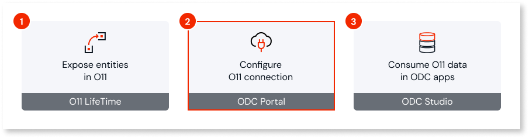
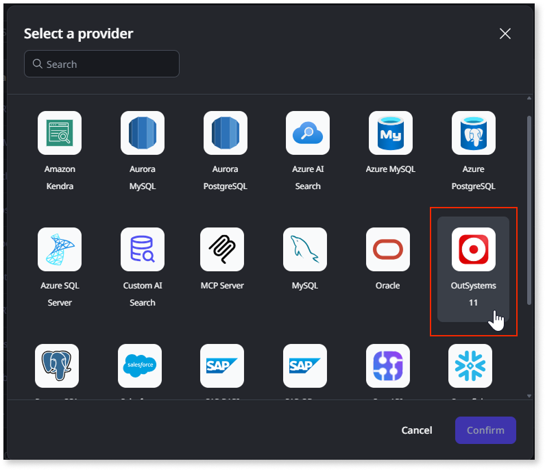
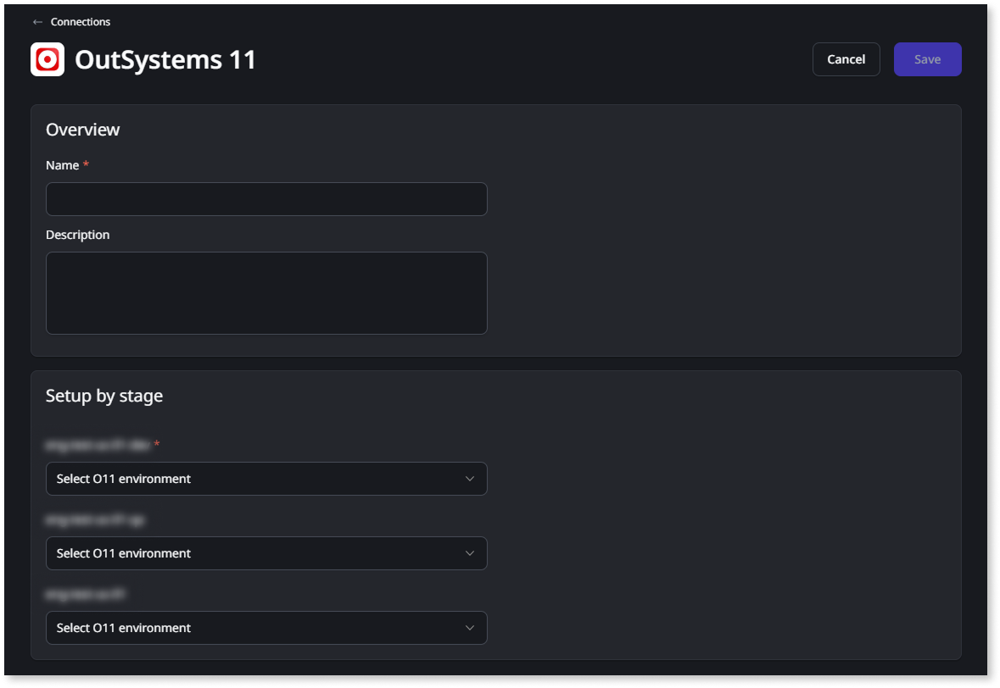
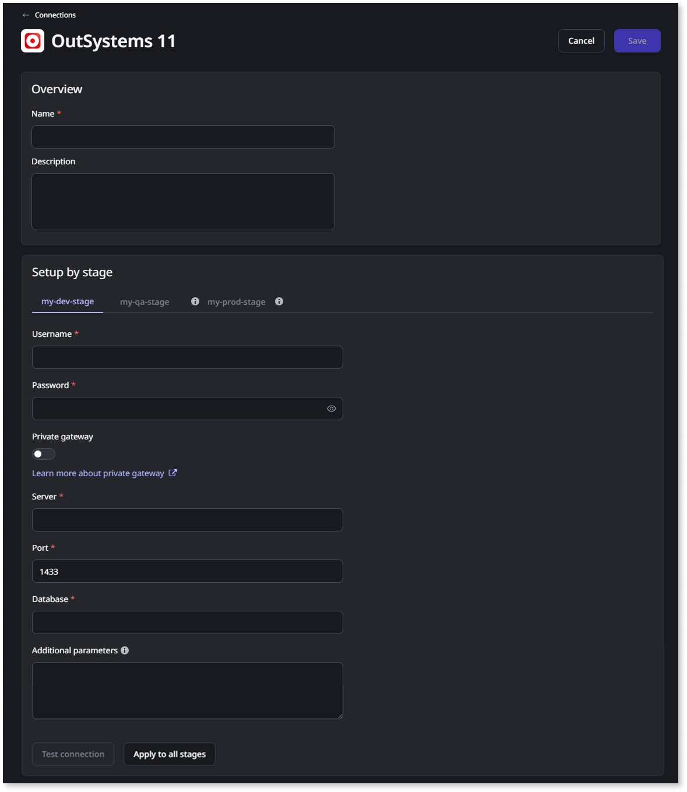
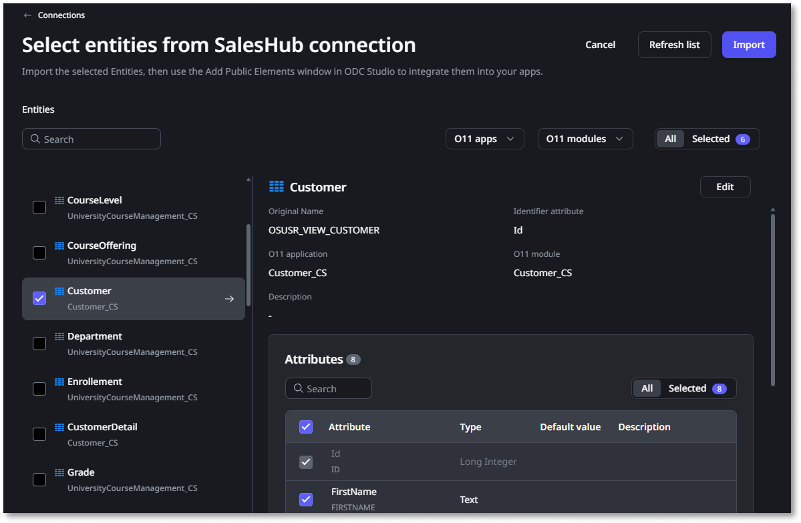

# Configure the O11 connection in ODC Portal

After [exposing your O11 entities](expose-entities.md), you need to configure the O11 connection to make those entities available in ODC.

Start by [connecting ODC to your O11 infrastructure](#connect-o11-infrastructure). Then, you can [create data connections](#create-connection) to [import the O11 entities](#import-exposed) that developers can [use in their ODC apps](consume-entities.md).

## Prerequisites

Before you start, ensure the following requirements are met:

* You have LifeTime 11.29.0 or later installed.

* The O11 entities you want to use in ODC have already [been exposed in LifeTime](expose-entities.md).

* The user connecting ODC to the O11 infrastructure has the **Administrator** role.

* The user creating the data connection has **Connection management > Create** permission.

* The user defining which entities are imported in the data connection has the **Configuration management > Configure connections** permission.

* The [required network connectivity](data-interop.md#prerequisites) from ODC to your O11 infrastructure is in place.

* If you have an O11 self-managed infrastructure, ensure the following:

    * A database administrator performed the [required database operations](data-interop-self-managed.md#on-expose) for the O11 environments where developers exposed or promoted entities.

    * You have the details of the database connection (Server, Port, Database Name or Host, Port, Service Name), and database dedicated user (username and password) for each of the [O11 environments to map](data-interop.md#mapping).

## Connect ODC to your O11 infrastructure {#connect-o11-infrastructure}

This step requires the **Administrator** role and LifeTime 11.29.0 or later.

This is a one-time setup that establishes the link between your ODC organization and your O11 infrastructure.

To prevent cross-organization access, ODC accepts only LifeTime service accounts that you bind to your ODC organization ID in LifeTime, and validates that binding when you save the configuration.

For this configuration you have to switch between the ODC Portal and LifeTime to complete the setup. Follow these steps:

1. In the ODC Portal, go to **OUTSYSTEMS 11 > Configurations**.

1. Set the **URL** of the LifeTime environment you want to integrate with.

1. Copy the **ODC organization ID** shown on the page.

1. In LifeTime, [create a new service account](https://www.outsystems.com/tk/redirect?g=1f0c3b37-45b9-4a4d-b640-016dac5f5d6b) bound to your ODC organization:

    1. Assign the **Administrator** role to the service account.

    1. Set **Service account consumer** to **ODC**.

    1. Paste the value you copied into the **ODC organization ID** field.

    1. Save the service account and copy the generated authentication token.

1. Back in the ODC Portal, paste the value into the **Authentication Token** field.

1. Click **Save**. ODC validates the token against your ODC organization ID.

## Create an O11 data connection {#create-connection}

This step requires the **Connection management > Create** permission.

After linking your infrastructures, let's create the data connection to OutSystems 11.

You can create different connections for your O11 infrastructure. For example:

* You can group O11 entities from different business apps in different connections to be used by different teams in ODC.

* If your O11 infrastructure has additional pipelines, create one connection per pipeline.

To create the connection, follow these steps:

1. In the ODC Portal, go to **INTEGRATE > Connections**.

1. Click **Create connection**.

1. Select the **OutSystems 11** provider.

    

1. Enter a unique **Name** and an optional **Description** for your connection.

1. Map each ODC stage to the [corresponding O11 environment](data-interop.md#mapping).

    

    For O11 infrastructures with additional pipelines, make sure the selected O11 environments are part of the O11 pipeline you are mapping.

    For example, consider you have two O11 pipelines, **Finance** and **HR**. If you are creating the connection for the **Finance** pipeline, make sure you select only O11 environments from that pipeline. To import O11 entities from the **HR** pipeline, create another connection to map the O11 environments from that pipeline.

    

    The configuration is different for O11 Cloud and O11 self-managed infrastructures:

    * If you have an **O11 Cloud** infrastructure, use the dropdowns in the **Setup by stage** section to map each ODC stage to the corresponding O11 environment.

        ODC automatically handles the underlying complexity, such as creating the dedicated database users and connection details for each mapping.

        

    * If you have an **O11 self-managed** infrastructure, in the **Setup by stage** section, provide the database connection details and test the connection for each ODC stage, similar to [creating connections to external data sources](../../eap/integration-with-systems/external-databases/create-connection-external-data.md):

        * Set the **Username** and **Password** of the dedicated database user for interoperability created during [the initial setup](data-interop-self-managed.md#setup).

        * For SQL Server, set the **Server**, **Port**, and **Database** for each O11 environment.

        * For Oracle, set the **Host**, **Port**, and **Service name** for each O11 environment.

        

        If you are using a **Private gateway**, switch the toggle on and fill the corresponding information.

        

        

1. Click **Save**. The system now begins the connection setup process in the background.

For O11 cloud infrastructures, creating the connection is an asynchronous process that may take a few minutes. You can monitor its progress on the Connections screen. If the setup fails, the status updates to **Failed**, and the page displays an error message to help you diagnose the issue. You can use the **Retry** option to attempt the setup again.

## Import exposed O11 entities {#import-exposed}

This step requires the **Configuration management > Configure connections** permission.

Once the connection is successfully created, you can import the exposed entities you want to use. The connection automatically preserves the familiar logical names from O11, so you can work with entities like `Customer` directly.

Follow these steps to import the exposed entities:

1. In the ODC Portal, go to **INTEGRATE > Connections**.

1. In the connections list, click **Import** for the OutSystems 11 connection you want to use.

1. Select the exposed O11 entities you want to import. OutSystems automatically selects and imports all the attributes for each O11 entity.

    

    The O11 system entities **User** and **Tenant** are [exposed to ODC by default](expose-entities.md#user-tenant) and available to import. Filter the **O11 modules** by **(O11 system)** to see them in the entities list.

    

1. Click **Import**.

Developers can now [consume the imported O11 entities](consume-entities.md) in their ODC apps.

## Refresh the exposed O11 entities {#refresh-exposed}

When there's a [change to the exposed O11 entities](expose-entities.md#update-exposed), you need to refresh the connection in ODC:

1. In the ODC Portal, go to **INTEGRATE > Connections**.

1. In the connections list, click **Import** for the OutSystems 11 connection including the entities you want to refresh.

1. Click **Refresh list**.

Developers can now update the dependencies in their ODC apps to reflect the changes. For further details, see how to [handle O11 data model changes in ODC apps](handle-o11-data-model-changes.md).
