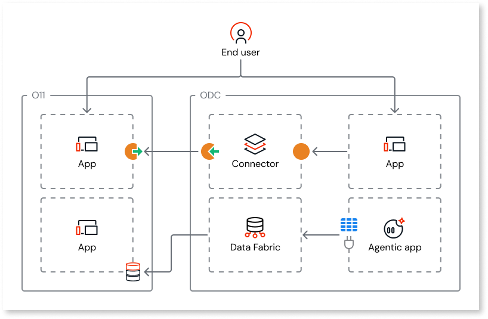

# Extending O11 with ODC

You can extend your existing O11 portfolio with new [ODC cloud-native and AI-powered capabilities](https://www.outsystems.com/low-code-platform/developer-cloud/) by building new ODC apps that seamlessly consume your trusted resources from your existing O11 apps.

This interoperability approach enables you to maintain and evolve your core apps on O11 while using ODC to deliver new AI-powered agents, digital experiences, or high-performance portals.

## Interoperability capabilities

O11 and ODC interoperability covers three areas:

* [Data interoperability](data-interoperability/data-interop.md): ODC apps access and write to O11 entities directly, without custom APIs

* [Logic interoperability](logic-interoperability/logic-interop.md): O11 and ODC apps call each other's business logic via REST

* [User interoperability](https://www.outsystems.com/tk/redirect?g=501b4fbe-f991-40da-9cae-e21d4c5025fc): End users authenticate once and navigate seamlessly between O11 and ODC apps without re-authenticating

## Interoperability use cases

Here are some scenarios where you can use ODC cloud-native capabilities to extend your O11 core apps:

* **New agentic use cases that leverage Agent Workbench:** An agent that classifies support tickets by assigning tags, teams, and priority, reading O11 data via the ODC Data Fabric connector and writing back.

* **Existing O11 apps enhanced with agentic flows:** Existing O11 apps with embedded conversational agents, or calling an agent via REST to quickly summarize a customer record.

* **High-scale B2C apps:** Public-facing apps with unpredictable usage peaks that require the auto-scaling capabilities of ODC (for example, a Black Friday campaign app).

* **Apps with low O11 dependencies:** New use cases, such as a field-service mobile app, that are mostly self-contained but leverage some existing O11 data (like customer lists) or logic.

* **Extension portals:** New portals (for example, a Customer Loyalty Rewards portal) built in ODC that read core details from O11 but store their own operational data (rewards, catalogs) natively in ODC.

For any of the above scenarios, if end users navigate between O11 and ODC apps, user interoperability provides a seamless authentication experience.

## Use cases to keep evolving in O11

There are scenarios where extending with ODC may not be the right path. Here are some examples where you should continue developing in O11:

* **Extensions of existing O11 apps:** Adding screens or UI components to an existing O11 application (for example, adding a new section to an existing Customer Portal), or making minor additions to a tightly coupled O11 system.

* **Heavy dependencies:** New applications that require a large amount of O11 data and logic owned by different business owners, where the integration complexity would outweigh the benefits of the new platform.

## Getting started

Before you start, check the [version requirements](version-requirements.md) for your O11 infrastructure and development tools to use O11 and ODC interoperability capabilities.
