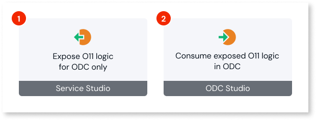
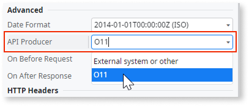
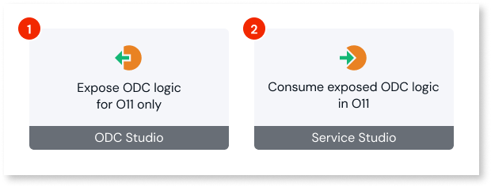
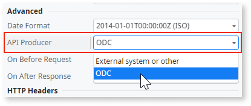

# Reuse logic between O11 and ODC

Logic interoperability requires that you expose and consume your business logic through REST exclusively between your O11 and ODC platform instances. This page describes how it works.

Make sure you follow the [best practices for reusing logic between O11 and ODC](logic-interop-best-practices.md).

## Reusing O11 logic in ODC {#reuse-o11-logic-odc}

When reusing your O11 logic in ODC apps, you can use a [secure connection](#secure) to route the REST API requests. Otherwise, API requests are accessible by the internet as any other REST integration.

Reusing your O11 logic in ODC apps for interoperability purposes involves two key steps:

1. [Expose your O11 logic through a REST API](https://www.outsystems.com/tk/redirect?g=08e6c830-5f88-4645-b86f-412e1c399a1f) to be exclusively consumed in ODC.

    In Service Studio, define the intent of the integration by setting the REST API property **API Consumer** to **ODC**.

    

1. [Consume the exposed O11 REST API in ODC](../../eap/integration-with-systems/consume_rest/intro.md).

    In ODC Studio, define the intent of the integration by setting the REST API property **API Producer** to **O11**.

    

### Reusing O11 logic through a secure connection {#secure}

After you deploy an ODC app consuming O11 logic to an ODC stage, follow these steps if you want to route the REST API requests through a secure connection:

1. Make sure an administrator has already [created the secure connection](logic-interop-secure-connection.md) in the ODC Portal between the **stage** where the app is deployed and the **O11 environment** exposing the logic, and provided you the secure **Base URL** to use in the REST integration.

1. [Adjust the configuration of your ODC app](../../eap/manage-platform-app-lifecycle/configuration-management.md#rest) for that ODC stage by setting the URL of the **Consumed REST APIs** to the secure **Base URL**.

You must adjust the ODC app configuration for all stages where it's deployed. For each stage, use the secure **Base URL** of the secure connection created for that stage.

## Reusing ODC logic in O11 {#reuse-odc-logic-o11}

Reusing your ODC logic in O11 apps for interoperability purposes involves two key steps:

1. [Expose your ODC logic through a REST API](../../eap/integration-with-systems/exposing_rest/intro.md) to be exclusively consumed in O11.

    In ODC Studio, define the intent of the integration by setting the REST API property **API Consumer** to **O11**.

    

1. [Consume the exposed ODC REST API in O11](https://www.outsystems.com/tk/redirect?g=5a949da9-dd60-4ea9-a05b-70c27bc53655).

    In Service Studio, define the intent of the integration by setting the REST API property **API Producer** to **ODC**.

    
