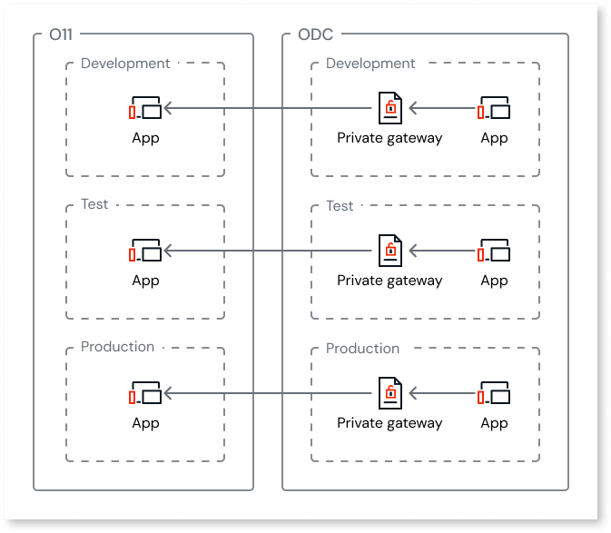
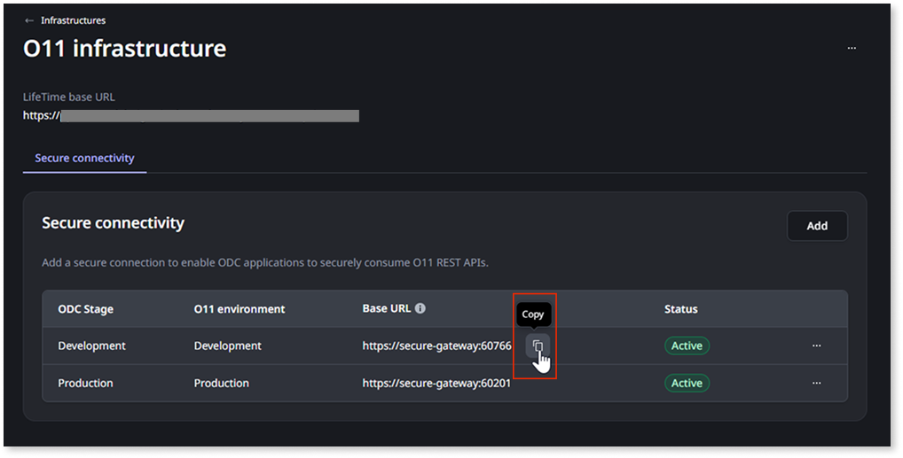

# Add a secure connection for O11 logic interoperability

When [consuming O11 logic in your ODC apps](logic-interop-reuse-o11-odc.md#reuse-o11-logic-odc), you can route the REST API requests through a secure private connection instead of the public internet. A secure connection sends the requests from an ODC stage to an O11 environment over a [private channel](logic-interop.md#security) that you can allowlist in your O11 firewall or network access policies. The setup differs depending on your O11 infrastructure type:

* For **O11 cloud** infrastructures, [add a secure connection](#secure-connection) in the ODC Portal.

* For **O11 self-managed** infrastructures, [configure an ODC private gateway](#self-managed).

This setup requires a distinct connection between each O11 environment exposing logic and the corresponding ODC stage consuming that logic.

## Add a secure connection {#secure-connection}

This procedure applies only to **O11 cloud** infrastructures. If you have an **O11 self-managed** infrastructure, [configure a private gateway](#self-managed) to connect to your for O11 infrastructure.

Before proceeding, make sure the following requirements are met:

* The ODC organization [is already connected to your O11 infrastructure](../connect-o11-infrastructure.md).

* You have the **Administrator** role in ODC Portal.

Follow these steps to add a secure connection that enables ODC apps deployed to an **ODC stage** to securely consume O11 REST APIs exposed in an **O11 environment**:

1. Log into the ODC Portal.

1. Under the **Management** menu, go to **OUTSYSTEMS 11 > Infrastructures**.

1. Click the infrastructure you want to configure.

1. Go to the **Secure connectivity** tab.

1. Click **Add**.

1. Select the **ODC Stage** consuming the O11 logic.

1. Select the **O11 Environment** exposing the logic to consume in ODC.

1. Click **Add**.

    The status shows **Adding** while the connection is being set up, and changes to **Active** when the connection is ready.

The **Base URL** is the endpoint address that developers must [configure for the apps in each ODC stage](logic-interop-reuse-o11-odc.md#secure) instead of the public O11 environment URL. Thus, after adding the secure connection, copy its **Base URL** and share it with the developers.

Deleting a secure connection that is actively used by ODC apps to consume O11 logic can cause those apps to stop working. Ensure no apps depend on the connection before deleting it.

## Configure a private gateway for O11 self-managed infrastructures {#self-managed}

To route REST APIs requests from ODC to an **O11 self-managed infrastructure** through a secure private connection, you need to configure a **private gateway**:

1. Follow [ODC documentation](../../eap/manage-platform-app-lifecycle/private-gateway.md) to configure an ODC private gateway.

    

    If you already configured a private gateway for [data interoperability](../data-interoperability/data-interop.md#security), configure a distinct reserved port for the logic interoperability tunnel with your [Cloud Connector](https://github.com/OutSystems/cloud-connector#usage). Each tunnel requires its own reserved port.

    

1. Share the resulting endpoint address (`secure-gateway:<port>`) with the developers as the **Base URL** to use when [consuming the O11 REST API in ODC apps](../../eap/integration-with-systems/consume_rest/intro.md), instead of the public O11 environment URL. For further details, see [Use endpoints in your apps](../../eap/manage-platform-app-lifecycle/private-gateway.md#use-endpoints-in-your-apps).
