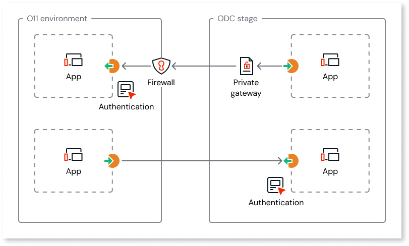

# Logic interoperability

OutSystems enables you to keep mission-critical core logic in O11 while [leveraging ODC modern capabilities](https://www.outsystems.com/low-code-platform/developer-cloud/) through REST integrations without affecting your [license consumption](#licensing).

Logic interoperability between O11 and ODC is bidirectional. You can:

* **Consume O11 logic in ODC**, for example, to trigger existing O11 business processes, validations, or integrations from an ODC app or agent. ODC-to-O11 REST API requests can be routed through a [private trusted communication channel](#security).

* **Consume ODC logic in O11** to extend your O11 apps with ODC cloud-native capabilities, such as AI agents, or a conversational agent embedded experience.

This page provides an overview of logic interoperability between ODC and O11. For further details, refer to [Reuse logic between O11 and ODC](logic-interop-reuse-o11-odc.md).

## Security

When **consuming O11 logic in your ODC apps**, you can [route REST API requests over a private gateway](logic-interop-secure-connection.md), which you can allowlist in your O11 firewall or network access policies.

When **consuming ODC logic in your O11 apps**, your REST APIs are accessible by the internet as any other REST integration.

In both cases, you should protect your endpoints from unauthorized access. OutSystems recommendation is using [token-based authentication](logic-interop-best-practices.md#authentication).

## Performance

When reusing business logic between O11 and ODC through REST APIs, app performance depends on the network latency between your O11 and ODC environments.
This should be considered in your application design.

## Licensing {#licensing}

REST integrations between O11 and ODC for interoperability purposes don't affect your license consumption, as they don't contribute to the [Application Object](https://www.outsystems.com/tk/redirect?g=cd994c70-9dcc-46ed-b423-84099beac39a) count. See how to [set up your REST integration for interoperability purposes](logic-interop-reuse-o11-odc.md).

REST integrations with any other external system follow the regular license consumption, contributing to the [Application Object](https://www.outsystems.com/tk/redirect?g=cd994c70-9dcc-46ed-b423-84099beac39a) count.

## Limitations {#limitations}

Your ODC apps can consume O11 logic over a secure private connection. However, this secure connection **isn't supported** for the following scenarios:

* Consuming ODC logic in O11 apps
* [ODC self-hosted](../../eap/manage-platform-app-lifecycle/self-hosted/sh-overview.md)

For the above scenarios, ensure a secure communication by [protecting your endpoints from unauthorized access](#security).

## Prerequisites {#prerequisites}

Before you start, make sure the following requirements are met:

* You have an O11 infrastructure and an ODC organization.

* Your O11 environments and development tools meet the required **Platform Server** and IDE versions.
  Refer to [interoperability version requirements](../version-requirements.md#logic-interop) for the full list.

* If you want to consume O11 logic in your ODC apps through a secure private connection, ensure your ODC organization [is already connected to the O11 infrastructure](../connect-o11-infrastructure.md) exposing that logic.
