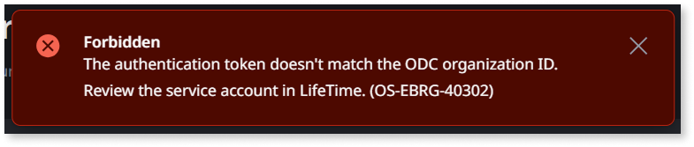

# Troubleshooting O11 and ODC connection issues

This page describes some common issues you may encounter when connecting your ODC organization to an O11 infrastructure, and how to solve them.

## Failure in validation of organization ID

When creating a new connection between your ODC and O11 infrastructure, the validation fails and you get the error OS-EBRG-40301, `The authentication token doesn't match the ODC organization ID`.

### Recommended action

If you are using a LifeTime service account that isn't bound to your ODC organization, create a new service account for O11-ODC interoperability with the following configuration:

* **Service account consumer** is set to **ODC**
* **ODC organization ID** matches the value in the ODC Portal

Refer to [Connect ODC to your O11 infrastructure](connect-o11-infrastructure.md#add-infrastructure) for further details.
