# Set up O11 and ODC single sign-on for O11 built-in authentication

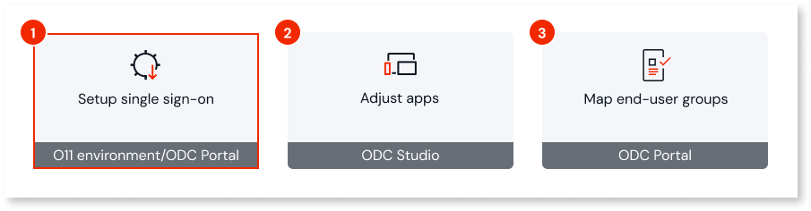

This page describes how you set up [O11 and ODC single sign-on](intro.md) when your end users authenticate in your O11 apps using the **Internal** [built-in authentication](https://www.outsystems.com/tk/redirect?g=eaa92f05-a00d-4e75-a937-8c100b81d6df) - the end-user information is stored in the OutSystems database.

In this scenario, the [UsersIdP component](https://www.outsystems.com/forge/component-overview/25077/o11-users-idp-o11) enables the **O11 Users app** to act as an [external OpenID Connect provider](../../eap/manage-platform-app-lifecycle/external-idps/intro.md) for your ODC organization.

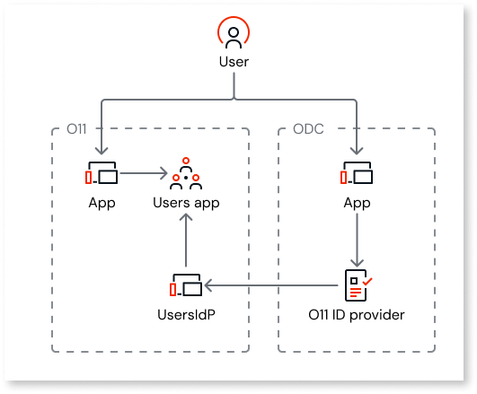

As end users in O11 aren't shared across environments, each O11 environment must have its own **UsersIdP** instance connected to the corresponding ODC stage.

For example, start by installing the UsersIdP component in your O11 development environment and connect it to your ODC development stage to enable SSO for end users accessing your development apps. Then, deploy the component to O11 QA and create a new connection to your ODC QA stage, and the same for production.

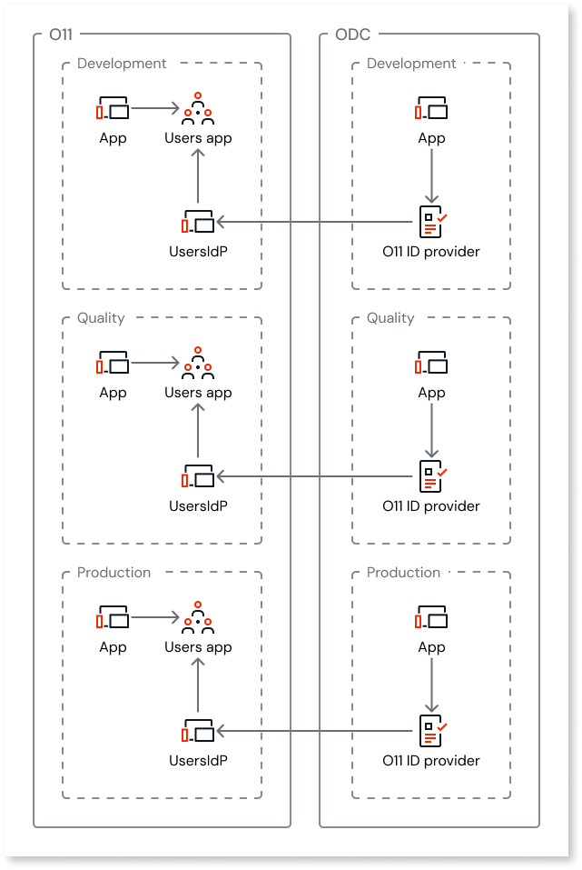

## Security {#security}

The UsersIdP component relies on standard identity protocols, with the following security characteristics:

* ODC validates a security token issued by the configured identity provider on each authentication request.

* No passwords or sensitive user attributes are synchronized or stored in ODC. ODC only consumes the user identity claims returned by the identity provider.

Like any external identity provider, the O11 Users app carries identity spoofing risks. A specific risk to be aware is that unvalidated email changes allow attackers to impersonate other users and access their ODC accounts. Thus, monitor O11 for suspicious attribute changes and ODC for unusual access patterns to detect potential impersonation attempts.

## Limitations {#limitations}

The **UsersIdP component** in only supported for:

* End-user authentication configured as **Internal Only** in the [Users app](https://www.outsystems.com/tk/redirect?g=2cbb2e7d-9936-4bb4-8791-240ade1d1ad6)

* The built-in **Users** app, it's not supported for customized versions of **Users**

* O11 apps with **Users** as user provider

## Prerequisites {#prerequisites}

Before you install and configure the UsersIdP component in an **O11 environment**, make sure the following requirements are met:

* Your O11 environments meet the required **Platform Server** version. Refer to [interoperability version requirements](../version-requirements.md#user-interop) for the full list.

* The environment is accessible from your ODC tenant over HTTPS.

* The UsersIdP component is a Reactive Web App. If your end users need to switch between Traditional Web Apps, Reactive Web Apps, Mobile Apps, and Progressive Web Apps (PWAs) in the same browser without signing in again, [enable Single Sign-On Between App Types](https://www.outsystems.com/tk/redirect?g=74fffe9e-d6fa-4ea9-a8ae-aa7a34a37511).

* The user installing and configuring the UsersIdP component must have:

    * Publish permissions on the O11 environment.

    * End-user administrator access to the UsersIdP app published in that O11 environment. This access can be granted by:

        * Using the [Administrator user](https://www.outsystems.com/tk/redirect?g=319FF915-A2E9-4A0B-AC8A-93E0A511E997) of the **Users** app in the environment.
        * Being [granted the role](https://www.outsystems.com/tk/redirect?g=0aa8f19f-5429-4b1d-bd3e-48575eb4ffc7) **UsersIdP_BO_Admin** in the UsersIdP app.

    * Administrator access to the ODC Portal of your organization.

## Configure O11 and ODC single sign-on with UsersIdP {#configure-sso}

This section describes how to install and configure the UsersIdP component in an O11 environment to act as an external OpenId Connect provider for your ODC organization.

### Install UsersIdP in O11 environment {#install}

The [UsersIdP component](https://www.outsystems.com/forge/component-overview/25077/o11-users-idp-o11) is available in the OutSystems Forge. Follow these instructions:

1. [Install the UsersIdP component from Forge](https://www.outsystems.com/tk/redirect?g=8dd13cd7-723f-456c-ac0d-e8981a266e2e) to the first environment of your O11 infrastructure.

1. Make sure the user proceeding with the environment configuration has end-user administrator access to the UsersIdP app.

    If the user isn't the [Administrator user](https://www.outsystems.com/tk/redirect?g=319FF915-A2E9-4A0B-AC8A-93E0A511E997) of the **Users** app in the environment, [grant them the role](https://www.outsystems.com/tk/redirect?g=0aa8f19f-5429-4b1d-bd3e-48575eb4ffc7) **UsersIdP_BO_Admin**.

When you need to set up O11 and ODC SSO for the subsequent environments in you pipeline, deploy the **UsersIdP** component to that environment as any other O11 app.

### Configure O11 environment as an external identity provider for ODC {#configure}

Once you have the UsersIdP component deployed in the O11 environment, you can proceed with its configuration by performing the following steps:

* [Step 1. Create the UsersIdP client in the O11 environment](#step-1)

* [Step 2. Add an O11 identity provider in the ODC organization](#step-2)

* [Step 3. Assign the O11 identity provider to an ODC stage](#step-3)

* [Step 4. Configure the redirect URIs in the O11 UsersIdP client](#step-4)

#### Step 1. Create the UsersIdP client in the O11 environment {#step-1}

1. Access the **UsersIdP BO** in your O11 environment (`https://<o11-environment-url>/UsersIdP_BO/`).

1. Login using your end-user credentials.

    You must be the [Administrator user](https://www.outsystems.com/tk/redirect?g=319FF915-A2E9-4A0B-AC8A-93E0A511E997) of the **Users** app in the environment, or have the **UsersIdP_BO_Admin** role.

1. Click **Add Client**.

1. Choose a client **Name** that identifies the connection to the ODC organization, for example “ODC”.

1. Click **Save**.

1. Check the **Include Groups Claim** option if you want to map your [O11 end-user groups](https://www.outsystems.com/tk/redirect?g=17e0082a-7169-482d-a383-89eeab15b9df) to [ODC end-user groups](../../eap/user-management/end-users/groups.md).

    

    Enabling the **Include Groups Claim** option adds the claim `groups` to the scope mapping claims.

    The UsersIdP component follows the same behavior as other external IdP providers regarding the maximum number of groups:

    * The `groups` claim is only included in the tokens if the end-user has up to a maximum number of groups. The maximum number of groups is 50 by default. You can configure this value using a site property in the module **UsersIdP_Core** of the UsersIdP component.

    * If the end-user has more than the maximum number of groups, the claim `hasgroups:true` is added instead.

    

1. Click **Add Secret**.

    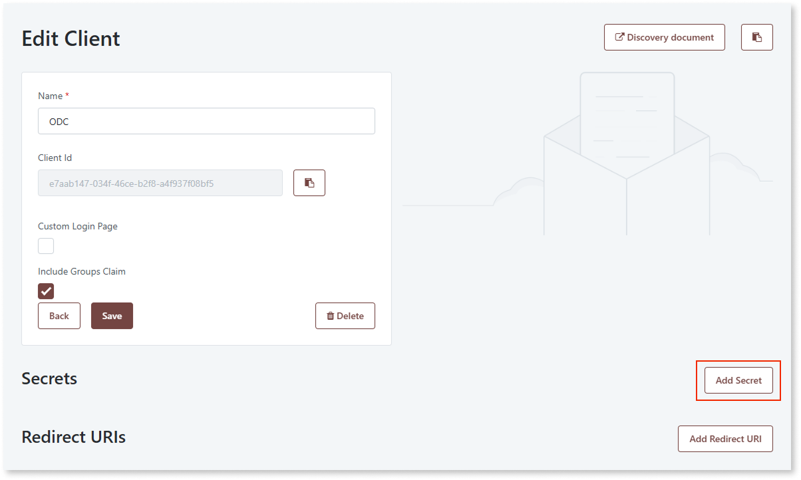

1. Choose the **Secret duration** according to your organization's policy.

    

    When the secret duration expires, the secret is no longer valid and the users' authentication fails. You then need to add a new secret and configure it in the O11 identity provider in ODC.

    To prevent service disruption to your end-users, make sure you generate a new secret and configure it in ODC before the current one expires.

    

    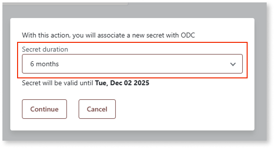

1. Click **Continue**.

1. Make sure you take note or save the secret in a secure place to use later, as it won't be shown again, and click **I saved the secret, close**.

    The UsersIdP client is now created in the O11 environment. You will need the **Client Id** and the **Secret** you saved when [configuring the O11 identity provider in ODC](#step-2).

    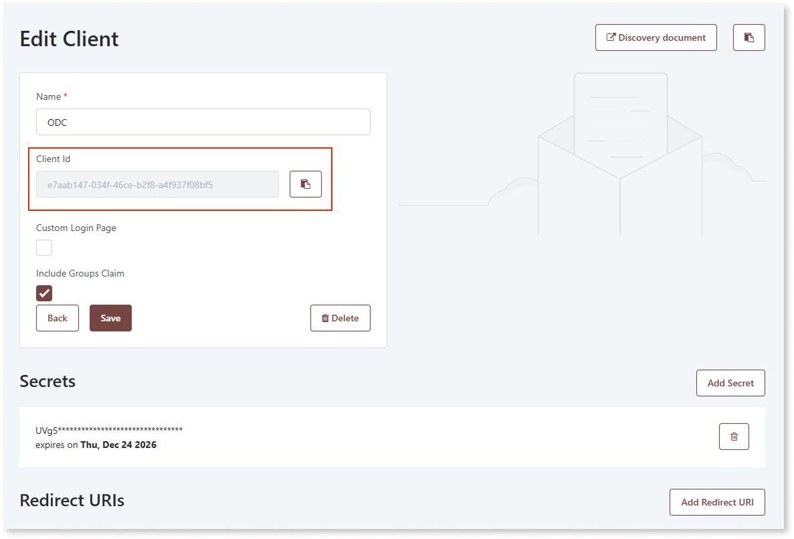

1. If you want to set a custom login page, for example to add your company branding, check the **Custom Login Page** option, and set the **Login Url** you want to use.

    

    The **Login Url** must be a local URL in the same O11 environment that includes a screen parameter to hold the redirect URL. The UsersIdP component appends the redirect URL to this parameter, so end users are redirected back after login. Example: `/MyLogin/Login?RedirectURL=`.

    

    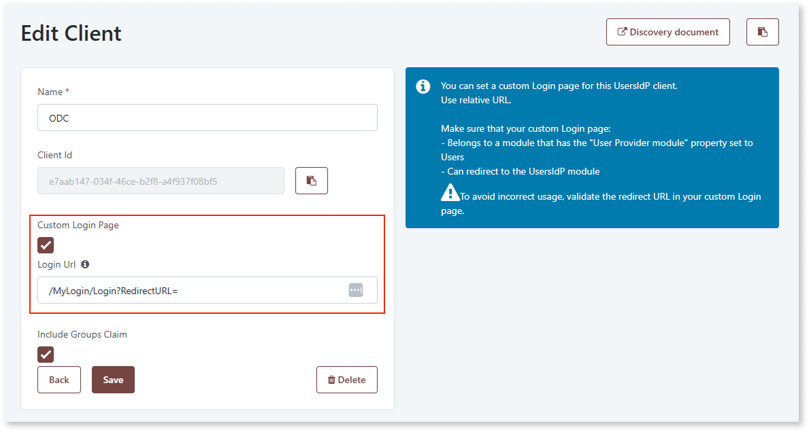

#### Step 2. Add an O11 identity provider in the ODC organization {#step-2}

In ODC, add OutSystems 11 as external identity provider to create the connection with UsersIdP:

1. Go to the ODC Portal.

1. Under the **Management** menu, go to **GOVERN > Identity providers**.

1. Click **Add provider > OutSystems11**.

    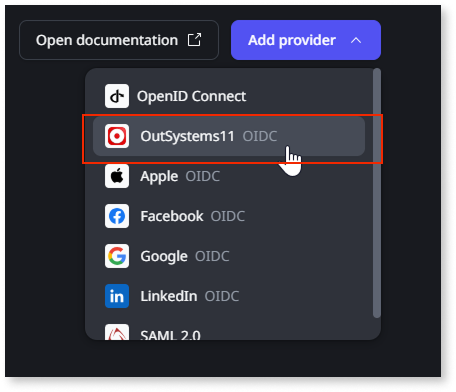

1. Fill in the provider details:

    * Choose a **Provider name** that identifies the O11 environment acting as external identity provider, for example “O11 Users QA”.

    * Set the **Discovery endpoint** to `https://<o11-environment-url>/UsersIdP/rest/connect/.well-known/openid-configuration`.

    * Click **Get details** to automatically fetch the client endpoints to the **Additional configuration** section.

    * Set the **Client ID** with the Client Id of your UsersIdP client.

    * Copy the UsersIdP client secret you previously saved to the **Client secret.**

    * On the **User profile mapping** section, select the fallback attribute that ODC uses for [profile matching](../../eap/manage-platform-app-lifecycle/external-idps/identity-claims-email-verification.md#user-profile-matching).

    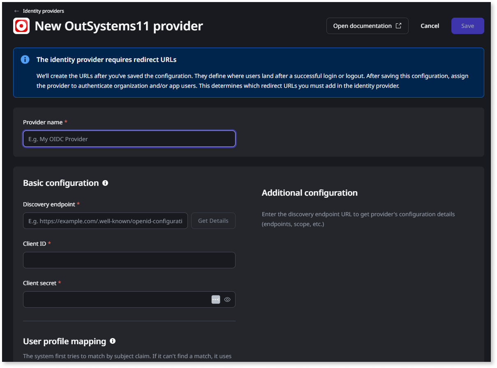

1. Click **Save**.

#### Step 3. Assign the O11 identity provider to an ODC stage {#step-3}

1. Go to the ODC Portal details screen of the O11 identity provider you just created.

1. Click **Manage assignments** at the top.

1. Select the ODC stage to use the configured O11 environment as external identity provider for end-user sign-in, and click **Next**.

    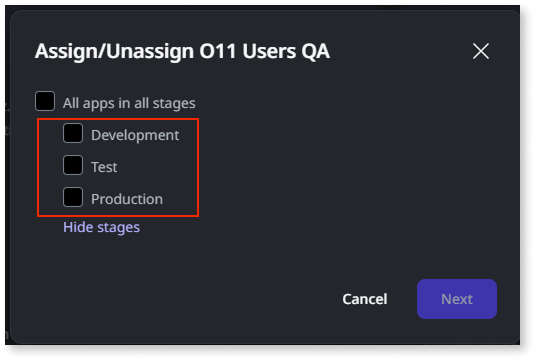

1. Click **Confirm**.

#### Step 4. Configure the redirect URIs in the O11 UsersIdP client {#step-4}

1. Still on the details screen of the created O11 identity provider, go to the **Redirect URLs** tab.

1. Expand the **App authentication** URLs for the stage(s) that will use the configured O11 environment as external identity provider (Development, QA, or Production), and copy the **Login URL** and **Logout URL**.

1. Go to the UsersIdP BO app in the O11 environment, and paste each of the copied **Login URLs** and **Logout URLs** to add new **Redirect URIs** for the configured UsersIdP client.

    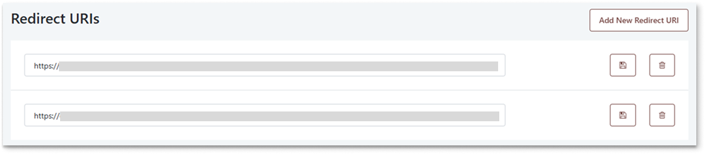

## Next steps {#next-step}

* [Adjust your apps for O11 and ODC single sign-on](modify-odc-app.md)
* [Map O11 and ODC end-user groups](map-end-user-groups.md)
