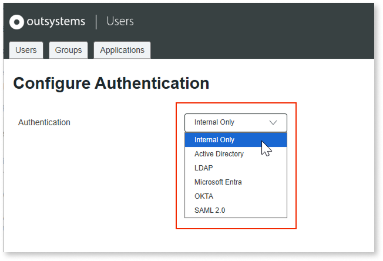

# User interoperability

As you build new ODC apps while maintaining your O11 portfolio, your end users might navigate across both platforms.
A fragmented login experience across platforms can disrupt their workflow, so it's crucial to plan for seamless authentication.

OutSystems provides single sign-on (SSO) capability so your O11 end users can access apps on both O11 and ODC without re-authenticating. End users are managed in your O11 authentication provider, eliminating user duplication and reducing administrative overhead.

There are two possible scenarios for O11 and ODC user interoperability, depending on how your O11 apps [authenticate end users](https://www.outsystems.com/tk/redirect?g=eaa92f05-a00d-4e75-a937-8c100b81d6df):

* **O11 built-in authentication** - If you configured end-user authentication as **Internal Only**, the built-in [Users app](https://www.outsystems.com/tk/redirect?g=2cbb2e7d-9936-4bb4-8791-240ade1d1ad6) is the authoritative source for end-user authentication, configured as an external OIDC identity provider for ODC. End users authenticate through O11 once, subsequent access to ODC apps is automatic if their O11 session remains active.

* **O11 external authentication** - If you configured end-user authentication to use an external method, such as Microsoft Entra or Okta, both O11 and ODC federate with that central identity provider. End users authenticate through the external system, not O11 or ODC directly.

Configuring SSO between your O11 and ODC apps involves the following key steps:

1. Set up single sign-on between both platforms

    This setup depends on how your O11 authentication scenario:

    * For **O11 built-in authentication**, [use the UsersIdP component](install-usersidp.md) to configure your O11 environments as external OpenID Connect providers for your ODC organization.

    * For **O11 external authentication**, [configure the same IdP in ODC](setup-external-idp.md).

    

    Align [O11 session timeout](https://www.outsystems.com/tk/redirect?g=74fffe9e-d6fa-4ea9-a8ae-aa7a34a37511) and [ODC session timeout](../../eap/user-management/configure-user-session.md), so end users don't get unexpected re-authentications when switching platforms.

    

1. [Adjust your ODC apps](modify-odc-app.md)

    Adjust or customize the built-in logic of your ODC apps for external provider login.

1. [Map O11 and ODC end-user groups](map-end-user-groups.md)

    Once the O11 and ODC single sign-on is set up, ensure that end users have the necessary permissions to access your ODC apps.

## Licensing {#licensing}

When user interoperability is enabled between ODC and O11, the same individual who uses apps on both platforms is tracked as an end user in each and contributes to the reported end-user count in each. Nonetheless, you only exceed your licensed capacity if usage in either individual platform surpasses its own limit - not the combined total across both. For further details on how OutSystems counts end users, refer to [End users](https://www.outsystems.com/tk/redirect?g=907b0fd3-bc46-4391-aae2-673296d795d9).

## Limitations {#limitations}

* The [UsersIdP component](install-usersidp.md) is only supported for **O11 built-in authentication**.

* For [O11 external authentication](setup-external-idp.md), user interoperability is only supported for the authentication protocols supported by ODC.

* You can't serve both your O11 and your ODC apps from the same address. As OutSystems 11 and ODC run on separate infrastructures, a subdomain (for example, `apps.company.com`) can point to only one of them.

    OutSystems recommends using distinct subdomains for each platform - for example, `apps.company.com` for your O11 apps and `new.company.com` for your ODC apps. This preserves a consistent brand presence for end users while routing each request to the correct runtime.

## Next steps {#next-steps}

Now that you understand the concepts, you can proceed with the setup of SSO between your O11 and ODC apps. Follow the setup option for your O11 authentication method - [built-in authentication](install-usersidp.md) or [external identity provider](setup-external-idp.md).
