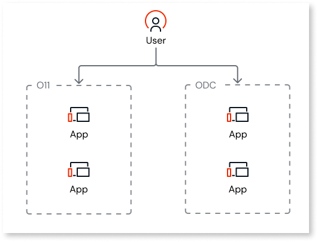
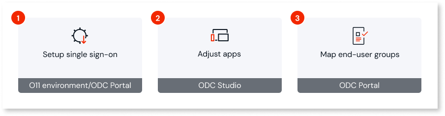

# User interoperability

As you build new ODC apps while maintaining your O11 portfolio, your end users might navigate across both platforms. A fragmented login experience across platforms can disrupt their workflow, so it's crucial to plan for seamless authentication.

OutSystems provides single sign-on (SSO) capability so your end users can access apps on both O11 and ODC without re-authenticating. You have two approaches for user interoperability between O11 and ODC:

* **O11 built-in authentication** - The built-in [Users app](https://www.outsystems.com/tk/redirect?g=2cbb2e7d-9936-4bb4-8791-240ade1d1ad6) is the authoritative source for end-user authentication, configured as an external OIDC identity provider for ODC. End users authenticate through O11 once, subsequent access to ODC apps is automatic if their O11 session remains active.

* **External identity provider** - Both O11 and ODC federate with a central identity provider, such as Microsoft Entra or Okta. End users authenticate through the external system, not O11 or ODC directly.

In both cases, end users are managed in a single location, either in O11 or your external identity provider, eliminating user duplication and reducing administrative overhead.

Configuring SSO between your O11 and ODC apps involves the following key steps:

1. Set up single sign-on between both platforms

    This setup depends on how your O11 apps [authenticate end users](https://www.outsystems.com/tk/redirect?g=eaa92f05-a00d-4e75-a937-8c100b81d6df):

    * If your O11 apps use the **Internal** built-in authentication, [use the UsersIdP component](install-usersidp.md) to configure your O11 environments as external OpenID Connect providers for your ODC organization.

    * If your O11 apps use an external identity provider, [configure the same IdP in ODC](setup-external-idp.md).

    

    Align [O11 session timeout](https://www.outsystems.com/tk/redirect?g=74fffe9e-d6fa-4ea9-a8ae-aa7a34a37511) and [ODC session timeout](https://www.outsystems.com/tk/redirect?g=596ba2aa-7ea4-4498-9f65-242e0b24e047), so end users don't get unexpected re-authentications when switching platforms.

    

1. [Adjust your ODC apps](modify-odc-app.md)

    Adjust or customize the built-in logic of your ODC apps for external provider login.

1. [Map O11 and ODC end-user groups](map-end-user-groups.md)

    Once the O11 and ODC single sign-on is set up, ensure that end users have the necessary permissions to access your ODC apps.

## Licensing {#licensing}

When user interoperability is enabled between ODC and O11, you can manage your licensed end-user capacity on a shared basis across both platforms. Although each platform counts its end users separately, usage is measured based on the combined utilization across both platforms. For further details on how OutSystems counts end users, refer to [End users](https://www.outsystems.com/tk/redirect?g=907b0fd3-bc46-4391-aae2-673296d795d9).

## Limitations {#limitations}

You can't serve both your O11 and your ODC apps from the same address. As OutSystems 11 and ODC run on separate infrastructures, a subdomain (for example, `apps.company.com`) can point to only one of them.

OutSystems recommends using distinct subdomains for each platform - for example, `apps.company.com` for your O11 apps and `new.company.com` for your ODC apps. This preserves a consistent brand presence for end users while routing each request to the correct runtime.

## Next steps {#next-steps}

Now that you understand the concepts, you can proceed with the setup of SSO between your O11 and ODC apps. Follow the setup option for your O11 authentication method - [built-in authentication](install-usersidp.md) or [external identity provider](setup-external-idp.md).
