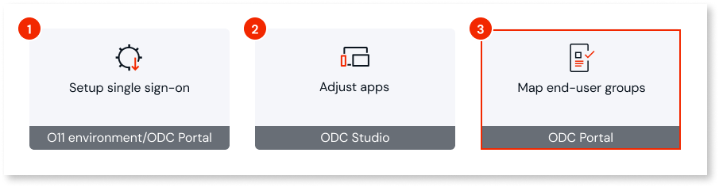

# Map O11 and ODC end-user groups

After you set up [single sign-on between O11 and ODC](intro.md) and [adjusted your apps](modify-odc-app.md), end users authenticating through O11 can sign in to your ODC apps.

To control what those end users can do in your ODC apps once signed in, map your existing [O11 end-user groups](https://www.outsystems.com/tk/redirect?g=17e0082a-7169-482d-a383-89eeab15b9df) to the corresponding [ODC end-user groups](https://www.outsystems.com/tk/redirect?g=16164200-5eb0-43b4-b43d-018634c3f330):

* For each ODC end-user group that should receive O11 users, [create an end-user group mapping](https://success.outsystems.com/documentation/outsystems_developer_cloud/user_management/configuring_authentication_with_external_identity_providers/idp_and_end_user_group_mapping/#create-mapping-end-user-groups-option).

    

    If you [set up O11 and ODC single sign-on using the UsersIdP component](install-usersidp.md):

    * Make sure the **Include Groups Claim** option is enabled in the [UsersIdP client for the O11 environment](install-usersidp.md#step-1).

    * Use the following values when [creating the end-user group mapping](https://success.outsystems.com/documentation/outsystems_developer_cloud/user_management/configuring_authentication_with_external_identity_providers/idp_and_end_user_group_mapping/#mapping-end-user-groups-option):<!-- TODO: Add relative link -->

        * **Provider**: The OutSystems11 identity provider for the O11 environment your are configuring

        * **Claim name**: `groups`

        * **Claim value (provider group)**: The O11 end-user group to map to the current ODC group

        * **Delimiter**: `,` (comma)

    

If you hit any issue, check the [common failure scenarios](troubleshooting.md) and how to handle them.
