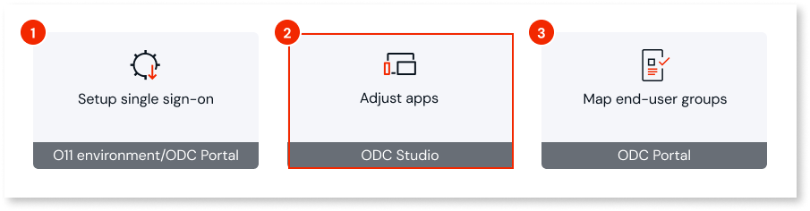
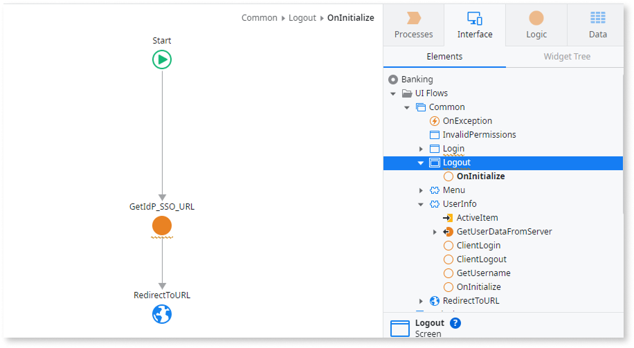
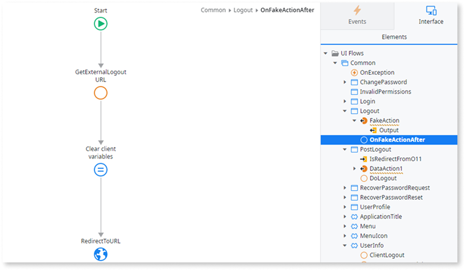
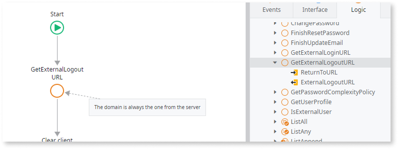
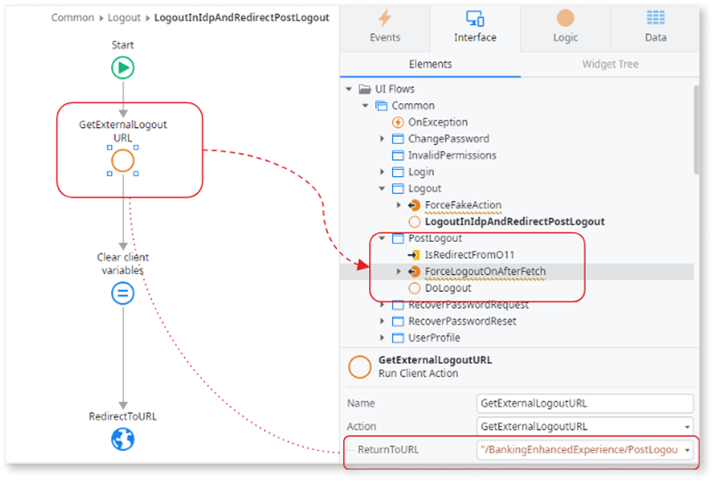

# Adjust apps for O11 and ODC single sign-on

After you set up the [single sign-on between O11 and ODC](intro.md), there are some scenarios that might require adjustments to your apps for external provider login:

1. Evaluate the need of adjusting the login logic of your ODC apps to use the configured external IdP and adjust them if needed.

    Follow [ODC documentation](https://success.outsystems.com/documentation/outsystems_developer_cloud/user_management/configuring_authentication_with_external_identity_providers/#use-an-idp-in-your-apps) for guidance. Some examples that need adjustments are:

    * If your apps were created with an ODC Studio version previous to 1.3.0.

        If your apps were created with ODC Studio version 1.3.0 or later, the pre-built login screen automatically shows the identity providers assigned to the app's stage. Thus, you don't need to change the login screen or flows.

    * If you want to customize the built-in login logic.

1. If you set up [O11 and ODC single sign-on for external authentication](setup-external-idp.md), you need to execute the following adjustments to your apps:

    * [Coordinate sessions between ODC and O11](#session-coordination)
    * [Handle the ODC-to-O11 logout redirect](#logout-redirect)

Having your apps adjusted, proceed with [mapping O11 and ODC end-user groups](map-end-user-groups.md).

## Coordinate sessions between ODC and O11 {#session-coordination}

This section applies only to [O11 and ODC single sign-on for external authentication](setup-external-idp.md).

On top of the end-user session held by the external IdP, O11 and ODC maintain their own end-user session.

The **login** process is seamless, as the platform automatically logs the end user in when a valid IdP session exists.

The **logout** process, however, requires terminating the IdP session first - if the IdP session remains active, the platform validates it and forces an automatic re-login.

To handle the logout correctly, you need to implement coordinated logout pages on both sides:

1. Add an **O11 logout page** that terminates the session and redirects the request to an ODC logout page.

    

1. Add an **ODC logout page** that terminates the session, and redirects the request to an O11 logout page. See how to [handle the logout redirect from ODC to O11](#logout-redirect).

    

## Handle the logout redirect from ODC to O11 {#logout-redirect}

This section applies only to [O11 and ODC single sign-on for external authentication](setup-external-idp.md).

The ODC system action `GetExternalLogoutURL` accepts a `ReturnToURL` input that would normally let you redirect end users back to a chosen URL after the IdP session is terminated. However, ODC automatically adds the ODC stage domain to that value, which prevents you from redirecting directly to an O11 URL.

To work around this limitation, add a second logout page to your ODC app:

1. In the **ODC logout page** that receives all logout requests and terminates the session, call the `GetExternalLogoutURL` with `ReturnToURL` pointing to a second ODC screen, **PostLogout**. This way, the IdP session terminates and the end user lands back inside ODC.

1. Add a **PostLogout** screen that redirects the end user to the O11 logout page, so the O11 session also terminates.

## Next step {#next-step}

* [Map O11 and ODC end-user groups](map-end-user-groups.md) so end users get the right permissions when they sign in to your ODC apps.
