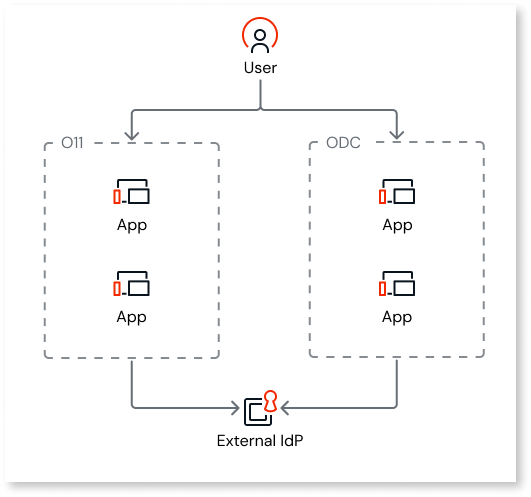

# Set up O11 and ODC single sign-on for O11 external authentication

This page describes how you set up [O11 and ODC single sign-on](intro.md) when your end users authenticate in your O11 apps using [external authentication](https://www.outsystems.com/tk/redirect?g=eaa92f05-a00d-4e75-a937-8c100b81d6df), such as **Microsoft Entra ID** or **Okta**.

## Prerequisites {#prerequisites}

To set up O11 and ODC single sign-on for an O11 external authentication scenario, make sure that authentication meets the following requirements:

* Is centrally configured in the [O11 Users app](https://www.outsystems.com/tk/redirect?g=eaa92f05-a00d-4e75-a937-8c100b81d6df) to every O11 app that uses **Users** as its user provider.

* Uses an authentication protocol that ODC supports:

    * **OpenID Connect (OIDC)** protocols, as such as Microsoft Entra ID or Okta
    * **SAML 2.0**

    Refer to [Configuring authentication with external identity providers](../../eap/manage-platform-app-lifecycle/external-idps/intro.md) for further details.

## Set up O11 external identity provider in ODC {#setup}

When your O11 apps authenticate end users through an external identity provider (IdP), configure authentication with the same external IdP in ODC. Refer to [ODC documentation](../../eap/manage-platform-app-lifecycle/external-idps/intro.md) to execute the following steps:

1. [Add the external IdP in ODC](../../eap/manage-platform-app-lifecycle/external-idps/intro.md#add-an-external-idp).

    If you disable fallback matching, by selecting **None** for the [user profile matching](../../eap/manage-platform-app-lifecycle/external-idps/identity-claims-email-verification.md#user-profile-matching) fallback attribute, make sure you remove the following mappings:

    * Remove the **Email** attribute from the **Claim mapping**.
    * Remove the **email** scope from the **Scope mapping**.

    O11 and ODC single sign-on for external authentication **won't work** if you disable fallback matching and keep the email mappings.

    

    If you plan to [convert your O11 apps to ODC](https://www.outsystems.com/tk/redirect?g=0a6f2684-c594-4eca-9cbf-0780c9b3c5ae), select one of the following values for the [user profile matching](../../eap/manage-platform-app-lifecycle/external-idps/identity-claims-email-verification.md#user-profile-matching) fallback attribute:

    * **Email**
    * **Username**

    The value **None** disables fallback matching and **isn't compatible** with the end-user migration process.

    

1. [Configure the redirect URIs](../../eap/manage-platform-app-lifecycle/external-idps/intro.md#idp-configure-uri).

1. [Assign the external IdP](../../eap/manage-platform-app-lifecycle/external-idps/intro.md#assign-an-external-idp) to your ODC stages for end-user authentication.

End users then sign in once at the IdP and reuse that session across your O11 and ODC apps, with no separate credentials to manage on the ODC side.

## Next steps {#next-step}

* [Adjust your apps for O11 and ODC single sign-on](modify-odc-app.md)
* [Map O11 and ODC end-user groups](map-end-user-groups.md)
