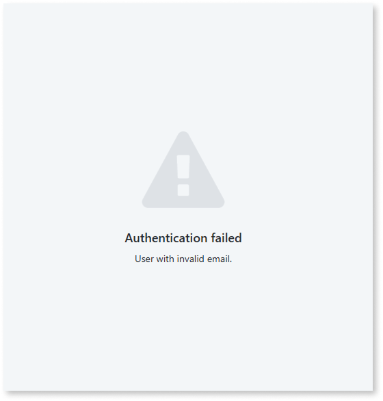
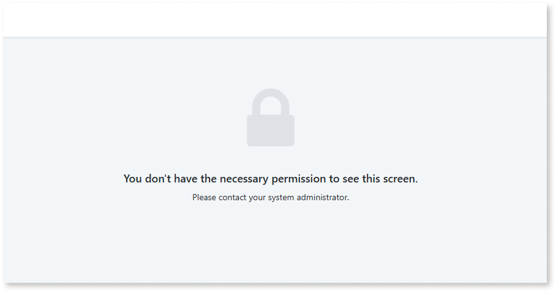

# Troubleshooting user interoperability issues

This page describes some common issues you may encounter for [user interoperability between ODC and O11 apps](intro.md), and how to solve them.

## Invalid email {#invalid-email}

### Symptoms {#invalid-email-symptoms}

When using [O11 and ODC single sign-on for built-in authentication](install-usersidp.md), the end user is redirected to the UsersIdP login screen. Then, they authenticate with a valid username and password, but get the error `User with invalid email`.

### Cause {#invalid-email-cause}

The authenticated end user doesn't have a valid email address configured in the [O11 Users app](https://www.outsystems.com/tk/redirect?g=2cbb2e7d-9936-4bb4-8791-240ade1d1ad6).

### Solution {#invalid-email-solution}

Set a valid email for the end user in the O11 Users app.

## Invalid permissions {#invalid-permissions}

### Symptoms {#invalid-permissions-symptoms}

After login, the end user gets an invalid permissions screen on the ODC app.

### Cause {#invalid-permissions-cause}

There are two possible causes for this issue:

* The end user is missing a required app role to access the screen.

* The ODC user was automatically created with no app roles assigned.

### Solution {#invalid-permissions-solution}

Make sure the needed [ODC app roles are assigned](map-end-user-groups.md) to the end-user.
